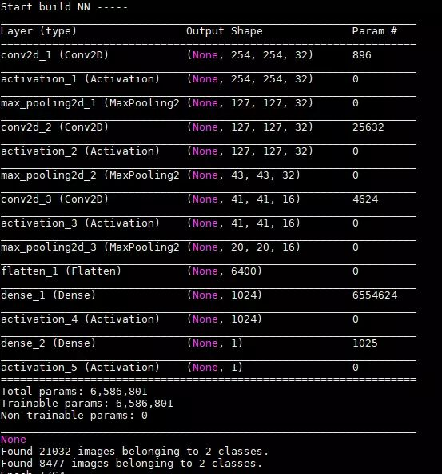
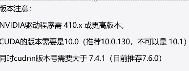
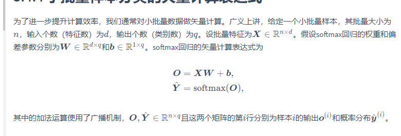
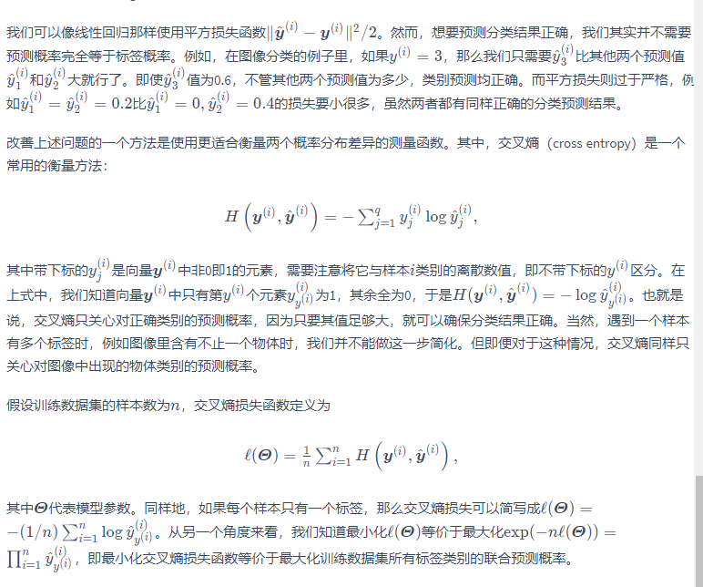

# Keras和TensorFlow的指南

# Keras篇

没有什么比官网更能说明Keras的简单之处了 [官网](https://keras.io/zh)

# 基本了解

## 指导原则

- **用户友好。** Keras 是为人类而不是为机器设计的 API。它把用户体验放在首要和中心位置。Keras 遵循减少认知困难的最佳实践：它提供一致且简单的 API，将常见用例所需的用户操作数量降至最低，并且在用户错误时提供清晰和可操作的反馈。
- **模块化。** 模型被理解为由独立的、完全可配置的模块构成的序列或图。这些模块可以以尽可能少的限制组装在一起。特别是神经网络层、损失函数、优化器、初始化方法、激活函数、正则化方法，它们都是可以结合起来构建新模型的模块。
- **易扩展性。** 新的模块是很容易添加的（作为新的类和函数），现有的模块已经提供了充足的示例。由于能够轻松地创建可以提高表现力的新模块，Keras 更加适合高级研究。
- **基于 Python 实现。** Keras 没有特定格式的单独配置文件。模型定义在 Python 代码中，这些代码紧凑，易于调试，并且易于扩展。

------

## 快速开始：30 秒上手 Keras

Keras 的核心数据结构是 **model**，一种组织网络层的方式。最简单的模型是 [Sequential 顺序模型](https://keras.io/getting-started/sequential-model-guide)，它由多个网络层线性堆叠。对于更复杂的结构，你应该使用 [Keras 函数式 API](https://keras.io/getting-started/functional-api-guide)，它允许构建任意的神经网络图。

`Sequential` 模型如下所示：

```
from keras.models import Sequential

model = Sequential()
```

可以简单地使用 `.add()` 来堆叠模型：

```
from keras.layers import Dense

model.add(Dense(units=64, activation='relu', input_dim=100))
model.add(Dense(units=10, activation='softmax'))
```

在完成了模型的构建后, 可以使用 `.compile()` 来配置学习过程：

```
model.compile(loss='categorical_crossentropy',
              optimizer='sgd',
              metrics=['accuracy'])
```

如果需要，你还可以进一步地配置你的优化器。Keras 的核心原则是使事情变得相当简单，同时又允许用户在需要的时候能够进行完全的控制（终极的控制是源代码的易扩展性）。

```
model.compile(loss=keras.losses.categorical_crossentropy,
              optimizer=keras.optimizers.SGD(lr=0.01, momentum=0.9, nesterov=True))
```

现在，你可以批量地在训练数据上进行迭代了：

```
# x_train 和 y_train 是 Numpy 数组 -- 就像在 Scikit-Learn API 中一样。
model.fit(x_train, y_train, epochs=5, batch_size=32)
```

或者，你可以手动地将批次的数据提供给模型：

```
model.train_on_batch(x_batch, y_batch)
```

只需一行代码就能评估模型性能：

```
loss_and_metrics = model.evaluate(x_test, y_test, batch_size=128)
```

或者对新的数据生成预测：

```
classes = model.predict(x_test, batch_size=128)
```


# 基础函数


## layers


`keras.layers.Flatten(input_shape=(28, 28))` 把输入的二维数据转化为（）。28 * 28，） 的Ts。

如

```python
 # Flatten层将除第一维（batch_size）以外的维度展平
model = keras.Sequential([
    keras.layers.Flatten(input_shape=(28, 28)),
    keras.layers.Dense(10, activation=tf.nn.softmax)
])
```


## loss


## model


```python
#训练模型
model.compile(optimizer=tf.keras.optimizers.SGD(0.1),              loss = 'sparse_categorical_crossentropy',              		metrics=['accuracy']) model.fit(x_train,y_train,epochs=5,batch_size=256)

#比较测试数据上的表现
test_loss, test_acc = model.evaluate(x_test, y_test)
print('Test Acc:',test_acc)


```

​	

## 转化

`to_categorical` 有点像`tf.one-shot`

```
keras.utils.to_categorical(y, num_classes=None, dtype='float32')
```

Converts a class vector (integers) to binary class matrix.

E.g. for use with categorical_crossentropy.

**Arguments**

- **y**: class vector to be converted into a matrix (integers from 0 to num_classes).
- **num_classes**: total number of classes.
- **dtype**: The data type expected by the input, as a string (`float32`, `float64`, `int32`...)

**Returns**

A binary matrix representation of the input. The classes axis is placed last.

**Example**

```python
# Consider an array of 5 labels out of a set of 3 classes {0, 1, 2}:
> labels
array([0, 2, 1, 2, 0])
# `to_categorical` converts this into a matrix with as many
# columns as there are classes. The number of rows
# stays the same.
> to_categorical(labels)
array([[ 1.,  0.,  0.],
       [ 0.,  0.,  1.],
       [ 0.,  1.,  0.],
       [ 0.,  0.,  1.],
       [ 1.,  0.,  0.]], dtype=float32)
```


# 其他Keras使用细节

**1.查看GPU使用情况语句（Linux）**

```text
# 1秒钟刷新一次
watch -n 1 nvidia-smi
```

**2.指定显卡**

```text
import os
os.environ["CUDA_VISIBLE_DEVICES"] = "2"
```

这里指定了使用编号为2的GPU，大家可以根据需要和实际情况来指定使用的GPU

**3.GPU并行**

```text
from model import unet
G = 3 # 同时使用3个GPU
with tf.device("/cpu:0"):
    M = unet(input_rows, input_cols, 1)
model = keras.utils.training_utils.multi_gpu_model(M, gpus=G)
model.compile(optimizer=Adam(lr=1e-5), loss='binary_crossentropy', metrics =     ['accuracy'])
model.fit(X_train, y_train,
        batch_size=batch_size*G, epochs=nb_epoch, verbose=0, shuffle=True,
        validation_data=(X_valid, y_valid))
model.save_weights('/path_to_save/model.h5')
```

**4. 查看网络结构**

```python
print (model.summary())
```

效果如图:



**5.保存网络结构图**

```python
# 你还可以用plot_model()来讲网络保存为图片
plot_model(my_model, to_file='my_vgg16_model.png')
```

# TensorFlow篇


TensorFLow最大的优点在于模块化的设计极大地增强了模型构建的灵活性，但是同时也给新手带了难以综合理解的障碍。

[教程指引](https://github.com/machinelearningmindset/)


# TensorFlow1


## 基础知识

### `placeholder `

 placeholder 中的 None起到了说明向量维度，但隐含向量某一维度大小的功能 ,  通常batch_size可以指定None，以便调整样本量大小

Passing None to a shape argument of a tf.placeholder tells it simply that that dimension is unspecified, and to infer that dimension from the tensor you are feeding it during run-time (when you run a session). Only some arguments (generally the batch_size argument) can be set to None since Tensorflow needs to be able to construct a working graph before run time. This is useful for when you don't want to specify a batch_size before run time.

## `.Contrib`

contrib一般来说就是那些社区开发的功能，其能力和代码表现都是不错的，但是官方开发团队不一定会把它加入到未来版本中，甚至可能移除掉（比如tf2.0）。

In general, `tf.contrib` contains *contrib*uted code. It is meant to contain features and contributions that eventually should get merged into core TensorFlow, but whose interfaces may still change, or which require some testing to see whether they can find broader acceptance.

The code in `tf.contrib` isn't supported by the Tensorflow team. It is included in the hope that it is helpful, but it might change or be removed at any time; there are no guarantees.

The source of `tf.contrib.layers.sparse_column_with_hash_bucket` can be found at


# TensorFlow2

## 基础命令速查

记ts，Ts为Tensor实例

`tf.constant(X)` 创建一个Tensor实例，X可以为list，Tensor，Narray。

> 也可以使用 np.array(Ts)来吧Ts变成Na

`tf.reshape(x,(3,4))` 返回reshape过后的x的Ts。这条命令也可以换成`tf.reshape(x,(-1,4))`因为元素的个数是固定的，所以这个维度的数量可以推断出来。

`tf.zeros(shape_tuple)` 返回一个新的零Ts。

`tf.ones( shape_tuple)` 返回一个新的元素全为1的Ts。

`tf.random.normal(shape=[3,4], mean=0, stddev=1)` 返回一个元素为随机正太分布的Ts。

`tf.boolean_mask( tensor, mask, axis=0)`  根据掩码的True或False来选择tensor的对应axis上的数据是否留存。

一般来说来说，两个向量的至少要有K个（K>=1）维度的shape相同。

```python
# 2-D example
tensor = [[1, 2], [3, 4], [5, 6]]
mask = np.array([True, False, True])
boolean_mask(tensor, mask)  # [[1, 2], [5, 6]]
```

`tf.one_hot(indices, depth)` 返回一个 len(indices) * depth 的one-hot 矩阵。

```python
#one_hot实例：实现一个 交叉熵函数（y： K*N...*1）
#return ： K*N...*1
def cross_entropy(y_hat, y):
  
    y = tf.cast(tf.reshape(y, shape=[-1, 1]),dtype=tf.int32)
    y = tf.one_hot(y, depth=y_hat.shape[-1])
    y = tf.cast(tf.reshape(y, shape=[-1, y_hat.shape[-1]]),dtype=tf.int32)
    return -tf.math.log(tf.boolean_mask(y_hat, y)+1e-8)
```

`tf.argmax(ts, axis=1)` 返回一行中的最大值的下标。

```python
#实现定义一个Accuracy
# 描述,对于tensorflow2中，比较的双方必须类型都是int型，所以要将输出和标签都转为int型
def accuracy(y_hat, y):
    return np.mean((tf.argmax(y_hat, axis=1) == y))
```


`ts.shape` 返回一个表示Ts的形状的tuple。

`len(x)` 返回Ts的第一个维度中的元素的总数。

如 len( tf.ones((3,4)) ) 为3.


`tf.gather(params,indices,validate_indices=None,name=None,axis=0)`    (cv)根据索引获取数组特定下标元素的任务

主要参数：params：被索引的张量，indices：一维索引张量，name：返回张量名称              

  返回值：通过indices获取params下标的张量。

例子：

```python
import tensorflow as tf
tensor_a = tf.Variable([[1,2,3],[4,5,6],[7,8,9]])
tensor_b = tf.Variable([1,2,0],dtype=tf.int32)
tensor_c = tf.Variable([0,0],dtype=tf.int32)
with tf.Session() as sess:
    sess.run(tf.global_variables_initializer())
    print(sess.run(tf.gather(tensor_a,tensor_b)))
    print(sess.run(tf.gather(tensor_a,tensor_c)))
#上个例子tf.gather(tensor_a,tensor_b) 的值为[[4,5,6],[7,8,9],
#[1,2,3]],tf.gather(tensor_a,tensor_b) 的值为[[1,2,3],1,2,3]]


```

> 2.tf.gather_nd(params,indices,name=None)
>
> 功能和参数与tf.gather类似，不同之处在于tf.gather_nd支持多维度索引。
>
> 例子：
>
> import tensorflow as tf
> tensor_a = tf.Variable([[1,2,3],[4,5,6],[7,8,9]])
> tensor_b = tf.Variable([[1,0],[1,1],[1,2]],dtype=tf.int32)
> tensor_c = tf.Variable([[0,2],[2,0]],dtype=tf.int32)
> with tf.Session() as sess:
> ​    sess.run(tf.global_variables_initializer())
> ​    print(sess.run(tf.gather_nd(tensor_a,tensor_b)))
> ​    print(sess.run(tf.gather_nd(tensor_a,tensor_c)))
> tf.gather_nd(tensor_a,tensor_b)值为[4,5,6],tf.gather_nd(tensor_a,tensor_c)的值为[3,7].
>
> 对于tensor_a,下标[1,0]的元素为4,下标为[1,1]的元素为5,下标为[1,2]的元素为6,索引[1,0],[1,1],[1,2]]的返回值为[4,5,6],同样的，索引[[0,2],[2,0]]的返回值为[3,7].
>
> https://www.tensorflow.org/api_docs/python/tf/gather_nd
>
> 3.tf.batch_gather(params,indices,name=None)
>
> 支持对张量的批量索引，各参数意义见（1）中描述。注意因为是批处理，所以indices要有和params相同的第0个维度。
>
> 例子：
>
> import tensorflow as tf
> tensor_a = tf.Variable([[1,2,3],[4,5,6],[7,8,9]])
> tensor_b = tf.Variable([[0],[1],[2]],dtype=tf.int32)
> tensor_c = tf.Variable([[0],[0],[0]],dtype=tf.int32)
> with tf.Session() as sess:
> ​    sess.run(tf.global_variables_initializer())
> ​    print(sess.run(tf.batch_gather(tensor_a,tensor_b)))
> ​    print(sess.run(tf.batch_gather(tensor_a,tensor_c)))
> tf.gather_nd(tensor_a,tensor_b)值为[1,5,9],tf.gather_nd(tensor_a,tensor_c)的值为[1,4,7].
>
> tensor_a的三个元素[1,2,3],[4,5,6],[7,8,9]分别对应索引元素的第一，第二和第三个值。[1,2,3]的第0个元素为1,[4,5,6]的第1个元素为5,[7,8,9]的第2个元素为9,所以索引[[0],[1],[2]]的返回值为[1,5,9],同样地，索引[[0],[0],[0]]的返回值为[1,4,7].
>
> https://www.tensorflow.org/api_docs/python/tf/batch_gather
>
>  
>
>     在深度学习的模型训练中，有时候需要对一个batch的数据进行类似于tf.gather_nd的操作，但tensorflow中并没有tf.batch_gather_nd之类的操作，此时需要tf.map_fn和tf.gather_nd结合来实现上述操作。
>
> 

## 运算

直接举例

```python
#运算符（operator) 
#按元素加
X + Y

#按元素乘法：
X * Y

#按元素除法：
X / Y

#按元素做指数运算：
Y = tf.cast(Y, tf.float32)
tf.exp(Y)

#matmul函数做矩阵乘法。下面将X与Y的转置做矩阵乘法。由于X是3行4列的矩阵，Y转置为4行3列的矩阵，因此两个矩阵相乘得到3行3列的矩阵。
Y = tf.cast(Y, tf.int32)
tf.matmul(X, tf.transpose(Y))

#concatenate）。下面分别在行上（维度0，即形状中的最左边元素）和列上（维度1，即形状中左起第二个元素）连结两个矩阵
tf.concat([X,Y],axis = 0), tf.concat([X,Y],axis = 1)

#使用条件判断式可以得到元素为0或1的新的tensor。以X == Y为例，如果X和Y在相同位置的条件判断为真（值相等），那么新的tensor在相同位置的值为1；反之为0。

tf.equal(X,Y)
#{<tf.Tensor: shape=(3, 4), dtype=bool, numpy=
array([[False,  True, False,  True],
       [False, False, False, False],
       [False, False, False, False]])>
       }#
       
#对tensor中的所有元素求和得到只有一个元素的tensor。
## 求和
tf.reduce_sum(X) #
#<tf.Tensor: shape=(), dtype=int32, numpy=66>
#注意 上面和下面的shape 是空的

#范数
范数(norm)是数学中的一种基本概念。在泛函分析中，它定义在赋范线性空间中，并满足一定的条件，即①非负性；②齐次性；③三角不等式。它常常被用来度量某个向量空间（或矩阵）中的每个向量的长度或大小。

#tf.norm(X) default order='Euclidean' Euclidean


tf.norm(X)
X = tf.cast(X, tf.float32)
```

>The Frobenius norm, sometimes also called the Euclidean norm (a term unfortunately also used for the vector L^2-norm), is matrix norm of an m×n matrix A defined as the square root of the sum of the absolute squares of its elements,
>
>$$
>||A||_F=sqrt(\sum_{i=1}^m\sum_{j=1}^n|a_{ij}|^2)
>$$
>


## 广播

当对两个形状不同的tensor按元素运算时，可能会触发广播（broadcasting）机制：先适当复制元素使这两个tensor形状相同后再按元素运算。

定义两个tensor

```python
>>>A = tf.reshape(tf.constant(range(3)), (3,1))
>>>B = tf.reshape(tf.constant(range(2)), (1,2)
(<tf.Tensor: shape=(3, 1), dtype=int32, numpy=
 array([[0],
        [1],
        [2]])>,
 <tf.Tensor: shape=(1, 2), dtype=int32, numpy=array([[0, 1]])>
 
```

由于A和B分别是3行1列和1行2列的矩阵，如果要计算A + B，那么A中第一列的3个元素被广播（复制）到了第二列，而B中第一行的2个元素被广播（复制）到了第二行和第三行。如此，就可以对2个3行2列的矩阵按元素相加。

```python
>>> A+B
<tf.Tensor: shape=(3, 2), dtype=int32, numpy=
array([[0, 1],
       [1, 2],
       [2, 3]])>
```

## 索引

索引采取与Numpy的Narray类似的形式，

如一个4*3的Ts

```
>>>X[1:3]
tf.Tensor(
[[ 4.  5.  6.  7.]
 [ 8.  9. 10. 11.]], shape=(2, 4), dtype=float32)
>>>X[1:3, 1:3]
<tf.Tensor: shape=(2, 2), dtype=float32, numpy=
array([[ 5.,  6.],
       [ 9., 10.]], dtype=float32)> 
```

**赋值**

assign既可以对单个元素进行赋值，也可以对截取的一部分元素进行赋值。

```python
>>>X = tf.Variable(X) # 创建一个变量
>>>X[1,2].assign(9)
<tf.Variable 'UnreadVariable' shape=(3, 4) dtype=float32, numpy=
array([[ 0.,  1.,  2.,  3.],
       [ 4.,  5.,  9.,  7.],
       [ 8.,  9., 10., 11.]], dtype=float32)>

# 不论是截取一部分的tf变量，还是生成一个新的Con或者Var，他们都tf的Tensor
>>>X[1:2,:].assign(tf.ones(X[1:2,:].shape, dtype = tf.float32)*12)
#也可以这么赋值
>>>c.assign(a + b)

```


## 节约内存

Ts的运算结果都会重新开一个内存来保存结果，如果想节约内存，可以使用`assign_{运算符全名}`函数来减少内存。

```python
x.assing_sub(Y) 
X - Y # 两者等价
```

## 自动求梯度

Tf使用GradientTape() 来监视至少一个变量，来计算导数。

```python
>>>x = tf.reshape(tf.Variable(range(4), dtype=tf.float32),(4,1))
<tf.Tensor: shape=(4, 1), dtype=float32, numpy=
array([[0.],
       [1.],
       [2.],
       [3.]], dtype=float32)>

#函数𝑦=2𝑥^⊤𝑥关于x的梯度应为 4𝑥 。现在我们来验证一下求出来的梯度是正确的
>>>with tf.GradientTape() as t:
        t.watch(x)
        y = 2 * tf.matmul(tf.transpose(x), x)
    
   dy_dx = t.gradient(y, x)
>>>dy_dx
<tf.Tensor: shape=(4, 1), dtype=float32, numpy=
array([[ 0.],
       [ 4.],
       [ 8.],
       [12.]], dtype=float32)>


```

[2.3.3 对Python控制流求梯度](https://trickygo.github.io/Dive-into-DL-TensorFlow2.0/#/chapter02_prerequisite/2.3_autograd?id=_233-对python控制流求梯度)这里讲述了在控制流中也可以进行梯度求导。


## 数据划分

```python
batch_size = 10
# 将训练数据的特征和标签组合
dataset = tfdata.Dataset.from_tensor_slices((features, labels))
# 随机读取小批量
dataset = dataset.shuffle(buffer_size=num_examples)
dataset = dataset.batch(batch_size)
data_iter = iter(dataset) # 可以看到这里创建两个一个新的dataset的iter
```


## 定义模型


### Keras.Sequential()

`Tensorflow 2.0`推荐使用`Keras`定义网络，故使用`Keras`定义网络 我们先定义一个模型变量`model`，它是一个`Sequential`实例。 在`Keras`中，`Sequential`实例可以看作是一个串联各个层的容器。

在构造模型时，我们在该容器中依次添加层。 当给定输入数据时，容器中的每一层将依次推断下一层的输入尺寸。 重要的一点是，在`Keras`中我们**无须指定每一层输入的形状**。 线性回归，输入层与输出层等效为一层全连接层`keras.layers.Dense()`。

`Keras` 中初始化参数由 `kernel_initializer` 和 `bias_initializer` 选项分别设置权重和偏置的初始化方式。我们从 `tensorflow` 导入 `initializers` 模块，指定权重参数每个元素将在初始化时随机采样于均值为0、标准差为0.01的正态分布。偏差参数默认会初始化为零。`RandomNormal(stddev=0.01)`指定权重参数每个元素将在初始化时随机采样于均值为0、标准差为0.01的正态分布。偏差参数默认会初始化为零。

```python
from tensorflow import keras
from tensorflow.keras import layers
from tensorflow import initializers as init
model = keras.Sequential()
model.add(layers.Dense(1, kernel_initializer=init.RandomNormal(stddev=0.01)))
```


对于使用`Sequential`类构造的神经网络，我们可以通过weights属性来访问网络任一层的权重。回忆一下上一节中提到的`Sequential`类与`tf.keras.Model`类的继承关系。对于`Sequential`实例中含模型参数的层，我们可以通过`tf.keras.Model`类的`weights`属性来访问该层包含的所有参数。下面，访问多层感知机`net`中隐藏层的所有参数。索引0表示隐藏层为`Sequential`实例最先添加的层。

实际上，`tf.keras.Model`的子类都可以通过`weughts`参数来访问该模型的所有参数。比如

```python
net = tf.keras.models.Sequential()
net.add(tf.keras.layers.Flatten())
net.add(tf.keras.layers.Dense(256,activation=tf.nn.relu))
net.add(tf.keras.layers.Dense(10))

X = tf.random.uniform((2,20))
Y = net(X)

#可访问 Sequential模型中最先加入的layer的参数
net.weights[0], type(net.weights[0])

```


### build model from block 

可以从`tf.keras`模块中提供的一个模型构造类`tf.keras.Model`继承我们所需要的类。

如

```python
class MLP(tf.keras.Model):
    def __init__(self):
        super().__init__()
        #？？ 为啥这里可以没参数
        self.flatten = tf.keras.layers.Flatten()    # Flatten层将除第一维（batch_size）以外的维度展平
        self.dense1 = tf.keras.layers.Dense(units=256, activation=tf.nn.relu)
        self.dense2 = tf.keras.layers.Dense(units=10)

    def call(self, inputs):         
        x = self.flatten(inputs)   
        x = self.dense1(x)    
        output = self.dense2(x)     
        return output
```

以上的`MLP`类中**无须定义反向传播函数**。系统将通过自动求梯度而自动生成反向传播所需的`backward`函数。

我们可以实例化`MLP`类得到模型变量`net`。下面的代码初始化`net`并传入输入数据`X`做一次前向计算。其中，`net(X)`将调用`MLP`类定义的`call`函数来完成前向计算。

```python
X = tf.random.uniform((2,20))
net = MLP()
net(X)
```


### build complex model（这一部分还不太明白@@，叠罗汉）


虽然`Sequential`类可以使模型构造更加简单，且不需要定义`call`函数，但直接继承`tf.keras.Model`类可以极大地拓展模型构造的灵活性。下面我们构造一个稍微复杂点的网络`FancyMLP`。在这个网络中，我们通过`constant`函数创建训练中不被迭代的参数，即常数参数。在前向计算中，除了使用创建的常数参数外，我们还使用`tensor`的函数和Python的控制流，并多次调用相同的层。

```python
class FancyMLP(tf.keras.Model):
    def __init__(self):
        super().__init__()
        self.flatten = tf.keras.layers.Flatten()
        self.rand_weight = tf.constant(
            tf.random.uniform((20,20)))
        self.dense = tf.keras.layers.Dense(units=20, activation=tf.nn.relu)

    def call(self, inputs):         
        x = self.flatten(inputs)   
        x = tf.nn.relu(tf.matmul(x, self.rand_weight) + 1)
        x = self.dense(x)    
        while tf.norm(x) > 1:
            x /= 2
        if tf.norm(x) < 0.8:
            x *= 10
        return tf.reduce_sum(x)
```

在这个`FancyMLP`模型中，我们使用了常数权重`rand_weight`（注意它不是模型参数）、做了矩阵乘法操作（`tf.matmul`）并重复使用了相同的`Dense`层。下面我们来测试该模型的随机初始化和前向计算。

```python
net = FancyMLP()
net(X)
<tf.Tensor: id=220, shape=(), dtype=float32, numpy=24.381481>
```

因为`FancyMLP`和`Sequential`类都是`tf.keras.Model`类的子类，所以我们可以嵌套调用它们。

```python
class NestMLP(tf.keras.Model):
    def __init__(self):
        super().__init__()
        self.net = tf.keras.Sequential()
        self.net.add(tf.keras.layers.Flatten())
        self.net.add(tf.keras.layers.Dense(64, activation=tf.nn.relu))
        self.net.add(tf.keras.layers.Dense(32, activation=tf.nn.relu))
        self.dense = tf.keras.layers.Dense(units=16, activation=tf.nn.relu)


    def call(self, inputs):         
        return self.dense(self.net(inputs))

net = tf.keras.Sequential()
net.add(NestMLP())
net.add(tf.keras.layers.Dense(20))
net.add(FancyMLP())

net(X)
<tf.Tensor: id=403, shape=(), dtype=float32, numpy=3.2303767>
```


### 自定义layer


深度学习的一个魅力在于神经网络中各式各样的层，例如全连接层和后面章节中将要介绍的卷积层、池化层与循环层。虽然tf.keras提供了大量常用的层，但有时候我们依然希望自定义层。本节将介绍如何自定义一个层，从而可以被重复调用。

```python
X = tf.random.uniform((2,20))
```

######  custom layer without parameters

我们先介绍如何定义一个不含模型参数的自定义层。事实上，这和[“模型构造”]一节中介绍的使用`tf.keras.Model`类构造模型类似。下面的`CenteredLayer`类通过继承`tf.keras.layers.Layer`类自定义了一个将输入减掉均值后输出的层，并将层的计算定义在了`call`函数里。这个层里不含模型参数。

```python
class CenteredLayer(tf.keras.layers.Layer):
    def __init__(self):
        super().__init__()

    def call(self, inputs):
        return inputs - tf.reduce_mean(inputs)
```

我们可以实例化这个层，然后做前向计算。

```python
layer = CenteredLayer()
layer(np.array([1,2,3,4,5]))
<tf.Tensor: id=11, shape=(5,), dtype=int32, numpy=array([-2, -1,  0,  1,  2])>
```

我们也可以用它来构造更复杂的模型。

```python
net = tf.keras.models.Sequential()
net.add(tf.keras.layers.Flatten())
net.add(tf.keras.layers.Dense(20))
net.add(CenteredLayer())

Y = net(X)
Y
<tf.Tensor: id=42, shape=(2, 20), dtype=float32, numpy=
array([[-0.2791378 , -0.80257636, -0.8498672 , -0.8917849 , -0.43128002,
         0.2557137 , -0.51745236,  0.31894356,  0.03016172,  0.5299317 ,
        -0.094203  , -0.3885942 ,  0.6737736 ,  0.5981153 ,  0.30068082,
         0.42632163,  0.3067779 ,  0.07029241,  0.0343143 ,  0.41021633],
       [ 0.0257766 , -0.4703896 , -0.9074424 , -1.2818251 ,  0.17860745,
         0.11847494, -0.14939149,  0.20248316, -0.140678  ,  0.6033463 ,
         0.13899392, -0.08732668,  0.08497022,  0.8094018 ,  0.20579913,
         0.40613335,  0.2509889 ,  0.34718364, -0.6298219 ,  0.59436864]],
      dtype=float32)>
```

下面打印自定义层各个输出的均值。因为均值是浮点数，所以它的值是一个很接近0的数。

```python
tf.reduce_mean(Y)
<tf.Tensor: id=44, shape=(), dtype=float32, numpy=-2.9802323e-09>
```

##### 4.4.2 custom layer with parameters

我们还可以自定义含模型参数的自定义层。其中的模型参数可以通过训练学出。

```python
class myDense(tf.keras.layers.Layer):
    def __init__(self, units):
        super().__init__()
        self.units = units
	#使用build建立参数
    def build(self, input_shape):     # 这里 input_shape 是第一次运行call()时参数inputs的形状
        self.w = self.add_weight(name='w',
            shape=[input_shape[-1], self.units], initializer=tf.random_normal_initializer())
        self.b = self.add_weight(name='b',
            shape=[self.units], initializer=tf.zeros_initializer())

    def call(self, inputs):
        y_pred = tf.matmul(inputs, self.w) + self.b
        return y_pred
```

下面，我们实例化`MyDense`类并访问它的模型参数。我们可以直接使用自定义层做前向计算。

```python
dense = myDense(3)
dense(X)
dense.get_weights()
[array([[ 0.05307531, -0.01968029,  0.00317079],
        [-0.03745286, -0.0031012 , -0.0925727 ],
        [ 0.00653961, -0.0849395 , -0.00591413],
        [-0.03926834,  0.03737333, -0.08176559],
        [-0.02961348,  0.00735149, -0.04053285],
        [-0.0769348 , -0.01365675,  0.04430145],
        [ 0.05790468,  0.06002709,  0.00588025],
        [ 0.00912714, -0.04544574, -0.08150417],
        [ 0.01794734, -0.06478786, -0.0466853 ],
        [ 0.0007794 ,  0.07972597,  0.01827623],
        [ 0.04688237,  0.040658  ,  0.04173873],
        [ 0.07974287, -0.01226464,  0.03872328],
        [ 0.023996  , -0.044014  ,  0.01851312],
        [-0.04491149,  0.00450119,  0.03688556],
        [ 0.01733875, -0.01641337,  0.06909126],
        [-0.07539   , -0.0878872 ,  0.0091918 ],
        [-0.00092481, -0.06399333,  0.00150875],
        [-0.01826238, -0.06126164, -0.05938709],
        [ 0.04794892,  0.03742057, -0.0018529 ],
        [ 0.03086024,  0.00513093, -0.04271856]], dtype=float32),
 array([0., 0., 0.], dtype=float32)]
```

我们也可以使用自定义层构造模型。

```python
net = tf.keras.models.Sequential()
net.add(myDense(8))
net.add(myDense(1))

net(X)
<tf.Tensor: id=121, shape=(2, 1), dtype=float32, numpy=
array([[-0.00446665],
       [-0.0158301 ]], dtype=float32)>
```


## Layer

`tf.keras.layers.Embedding`

Embedding layer的作用主要在于学习词语的distributed representation并将极其稀疏的one-hot编码的词语进行降维。

## 随机初始化模型参数


为了避免神经网络传播的各个节点的变化完全一样，以及参数爆炸和衰减问题，我们需要进行参数初始化


###  Tensorflow2.0的默认随机初始化

随机初始化模型参数的方法有很多。在3.3节（线性回归的简洁实现）中，我们使用`kernel_initializer=init.RandomNormal(stddev=0.01)`使模型`model`的权重参数采用正态分布的随机初始化方式。不过，Tensorflow中`initializers`的模块参数都采取了较为合理的初始化策略（不同类型的layer具体采样的哪一种初始化方法的可参考[源代码](https://github.com/tensorflow/tensorflow/blob/master/tensorflow/python/keras/layers)），因此一般不用我们考虑。

### Xavier随机初始化

还有一种比较常用的随机初始化方法叫作Xavier随机初始化。 假设某全连接层的输入个数为*a*，输出个数为*b*，Xavier随机初始化将使该层中权重参数的每个元素都随机采样于均匀分布


它的设计主要考虑到，模型参数初始化后，每层输出的方差不该受该层输入个数影响，且每层梯度的方差也不该受该层输出个数影响。


## 模型定义中的初始化

我们经常需要使用其他方法来初始化权重。在下面的例子中，我们将权重参数初始化成均值为0、标准差为0.01的正态分布随机数，并依然将偏差参数清零

```python
class Linear(tf.keras.Model):
    def __init__(self):
        super().__init__()
        self.d1 = tf.keras.layers.Dense(
            units=10,
            activation=None,
            kernel_initializer=tf.zeros_initializer(),
            bias_initializer=tf.zeros_initializer()
        )
        self.d2 = tf.keras.layers.Dense(
            units=1,
            activation=None,
            kernel_initializer=tf.ones_initializer(),
            bias_initializer=tf.ones_initializer()
        )

    def call(self, input):
        output = self.d1(input)
        output = self.d2(output)
        return output

net = Linear()
net(X)
net.get_weights()
```

```python
[array([[0., 0., 0., 0., 0., 0., 0., 0., 0., 0.],
        [0., 0., 0., 0., 0., 0., 0., 0., 0., 0.],
        [0., 0., 0., 0., 0., 0., 0., 0., 0., 0.],
        [0., 0., 0., 0., 0., 0., 0., 0., 0., 0.],
        [0., 0., 0., 0., 0., 0., 0., 0., 0., 0.],
        [0., 0., 0., 0., 0., 0., 0., 0., 0., 0.],
        [0., 0., 0., 0., 0., 0., 0., 0., 0., 0.],
        [0., 0., 0., 0., 0., 0., 0., 0., 0., 0.],
        [0., 0., 0., 0., 0., 0., 0., 0., 0., 0.],
        [0., 0., 0., 0., 0., 0., 0., 0., 0., 0.],
        [0., 0., 0., 0., 0., 0., 0., 0., 0., 0.],
        [0., 0., 0., 0., 0., 0., 0., 0., 0., 0.],
        [0., 0., 0., 0., 0., 0., 0., 0., 0., 0.],
        [0., 0., 0., 0., 0., 0., 0., 0., 0., 0.],
        [0., 0., 0., 0., 0., 0., 0., 0., 0., 0.],
        [0., 0., 0., 0., 0., 0., 0., 0., 0., 0.],
        [0., 0., 0., 0., 0., 0., 0., 0., 0., 0.],
        [0., 0., 0., 0., 0., 0., 0., 0., 0., 0.],
        [0., 0., 0., 0., 0., 0., 0., 0., 0., 0.],
        [0., 0., 0., 0., 0., 0., 0., 0., 0., 0.]], dtype=float32),
 array([0., 0., 0., 0., 0., 0., 0., 0., 0., 0.], dtype=float32),
 array([[1.],
        [1.],
        [1.],
        [1.],
        [1.],
        [1.],
        [1.],
        [1.],
        [1.],
        [1.]], dtype=float32),
 array([1.], dtype=float32)]
```

## define initializer


可以使用`tf.keras.initializers`类中的方法实现自定义初始化。

```python
def my_init():
    return tf.keras.initializers.Ones()

model = tf.keras.models.Sequential()
model.add(tf.keras.layers.Dense(64, kernel_initializer=my_init()))

Y = model(X)
model.weights[0]

```

```python

<tf.Variable 'sequential_1/dense_4/kernel:0' shape=(20, 64) dtype=float32, numpy=
array([[1., 1., 1., ..., 1., 1., 1.],
       [1., 1., 1., ..., 1., 1., 1.],
       [1., 1., 1., ..., 1., 1., 1.],
       ...,
       [1., 1., 1., ..., 1., 1., 1.],
       [1., 1., 1., ..., 1., 1., 1.],
       [1., 1., 1., ..., 1., 1., 1.]], dtype=f
```


## Dropout


我们只需要在全连接层后添加`Dropout`层并指定丢弃概率。在训练模型时，`Dropout`层将以指定的丢弃概率随机丢弃上一层的输出元素；在测试模型时（即`model.eval()`后），`Dropout`层并不发挥作用。

```python
model = keras.Sequential([
    keras.layers.Flatten(input_shape=(28, 28)),
    keras.layers.Dense(256,activation='relu'),
    Dropout(0.2),
    keras.layers.Dense(256,activation='relu'),
    Dropout(0.5),
    keras.layers.Dense(10,activation=tf.nn.softmax)
])
```

## 损失函数

`Tensoflow`在`losses`模块中提供了各种损失函数和自定义损失函数的基类。


```python
from tensorflow import losses
#均方误差损失
loss = losses.MeanSquaredError()
#交叉熵损失
tf.losses.sparse_categorical_crossentropy(y_true,y_hat)
```


## 优化算法

`tensorflow.keras.optimizers` 模块提供了很多常用的优化算法比如SGD、Adam和RMSProp等。

们创建一个用于优化model 所有参数的优化器实例，并指定学习率为0.03的小批量随机梯度下降（SGD）为优化算法。

```python
from tensorflow.keras import optimizers
trainer = optimizers.SGD(learning_rate=0.03)
```

化器实例时通过`weight_decay`参数来指定权重衰减超（weight decay）


## 训练模型

在使用`Tensorflow`训练模型时，我们通过调用`tensorflow.GradientTape`记录动态图梯度，执行`tape.gradient`获得动态图中各变量梯度。通过 `model.trainable_variables` 找到需要更新的变量，并用 `trainer.apply_gradients` 更新权重，完成一步训练。

```python
num_epochs = 3
num_epochs = 3
for epoch in range(1, num_epochs + 1):
    for (batch, (X, y)) in enumerate(dataset):
        with tf.GradientTape() as tape:
            l = loss(model(X, training=True), y)

        grads = tape.gradient(l, model.trainable_variables)
        trainer.apply_gradients(zip(grads, model.trainable_variables))

    l = loss(model(features), labels)
    print('epoch %d, loss: %f' % (epoch, l))
```

> 一些关于`trainer.apply_gradients()`的官方补充
>
> Processing gradients before applying them.
>
> Calling `minimize()` takes care of both computing the gradients and applying them to the variables. If you want to process the gradients before applying them you can instead use the optimizer in three steps:
>
> 1. Compute the gradients with [`tf.GradientTape`](https://www.tensorflow.org/api_docs/python/tf/GradientTape).
> 2. Process the gradients as you wish.
> 3. Apply the processed gradients with `apply_gradients()`.
>
> 对了`apply_gradients()`也是可以接受list的，应该内部是for遍历的吧？

## 训练信息

下面我们分别比较学到的模型参数和真实的模型参数。我们可以通过`model.get_weights()`来获得其权重（`weight`）和偏差（`bias`）。


## 保存和存储

存储Ts，字典等等变量。

```python
#1
np.save('x.npy', x)
x2 = np.load('x.npy')
#2
y = tf.zeros(4)
np.save('xy.npy',[x,y])
x2, y2 = np.load('xy.npy', allow_pickle=True)
(x2, y2)
```

保存模型

我们可已在训练好模型之后，直接把模型的参数保存下来，甚至可以直接应用到一个新的相同结构的模型上去。

```python
#net 为训练好的模型
net.save_weights("4.5saved_model.h5")
#载入参数
net2(X)
net2.load_weights("4.5saved_model.h5")
```


## Numpy联动

### `ts.numpy()` 以及 `ts.mean()`

The TensorFlow [`tf.math`](https://www.tensorflow.org/api_docs/python/tf/math) operations convert Python objects and NumPy arrays to [`tf.Tensor`](https://www.tensorflow.org/api_docs/python/tf/Tensor) objects. The `tf.Tensor.numpy` method returns the object's value as a NumPy `ndarray`.类似的还有 `ts.mean()`。

`resduct_sum(x, axis=0, keepdims=True)` 保持原有维度并对同一列相加（把所有的行加一起，同理axis=1，就是把tf的同一行的数据加一起）

> 同样的定义方式，可以定义一个softmax
>
> ```python
> def softmax(logits, axis=-1):
>     return tf.exp(logits) / tf.reduce_sum(tf.exp(logits), axis, keepdims=True)
> ```


## GPU驱动

测试可用GPU

```python
import tensorflow as tf
import numpy as np
print(tf.__version__)

gpus = tf.config.experimental.list_physical_devices(device_type='GPU')
cpus = tf.config.experimental.list_physical_devices(device_type='CPU')
print("可用的GPU：",gpus,"\n可用的CPU：", cpus)

```

显示可用设备详细信息

```python
from tensorflow.python.client import device_lib
print(device_lib.list_local_devices())
```

指定特定设备

使用tf.device()来指定特定设备(GPU/CPU)

```python
with tf.device('GPU:0'):
    a = tf.constant([1,2,3],dtype=tf.float32)
    b = tf.random.uniform((3,))
    print(tf.exp(a + b) * 2)

```


## tf.math

`tf.math.maximum(x,0)` 返回最大值


## tf.random

`tf.random.uniform(shape, minval=0, maxval=None)` 返回从连续分布中得到的Ts。


# SkLearning

`sklearn.model_selection.train_test_split(arrays**,shuffle)`

**arrays**:可以输入N个arrays，同时返回2\*N个arrays。

**shuffle**: boolean 是否shuffle

**random_state**：指定随机数生成器的“种子”（int），否则就使用np的随机数。

**test_size** 和 **train_size**用来指定两个数据集的所占大小，一般设置浮点符，两个参数设置一个就ok

```python
>>> X_train, X_test, y_train, y_test = train_test_split(
...     X, y, test_size=0.33, random_state=42)
...
>>> X_train
array([[4, 5],
       [0, 1],
       [6, 7]])
>>> y_train
[2, 0, 3]
>>> X_test
array([[2, 3],
       [8, 9]])
>>> y_test
[1, 4]
```


# 系统命令

## 测试GPU使用


```python
import tensorflow as tf
import os

os.environ['TF_CPP_MIN_LOG_LEVEL'] = '2'  # 不显示等级2以下的提示信息

print('GPU', tf.test.is_gpu_available())

a = tf.constant(2.0)
b = tf.constant(4.0)
print(a + b)

```

## 清除当前Tensor环境

 在重复运行模型的时候，常常出现定义模型错误，使用如下命令可以清除之前定义的所有Tensor对话和变量。

`tf.keras.backend.clear_session`

`tf.compat.v1.reset_default_graph()` 类似的这个也可以

## 系统环境检查

nvidia-smi所在的位置为：
C:\Program Files\NVIDIA Corporation\NVSMI

cmd进入目录输入命令`nvidia-smi`即可：


## 获取本地帮助

#### dir

查看一个模块中可以的函数和类

通常我们可以忽略掉由`__`开头和结尾的函数（Python的特别对象）或者由`_`开头的函数（一般为内部函数）。通过其余成员的名字我们大致猜测出这个ramdom模块提供了各种随机数的生成方法，包括从均匀分布采样（`uniform`）、从正态分布采样（`normal`）、从泊松分布采样（`poisson`）等。

#### help

想了解某个函数或者类的具体用法时，可以使用`help`函数。让我们以`ones`函数为例，查阅它的用法。更详细的信息，可以通过[Tensorflow的API文档版本选择页](https://www.tensorflow.org/versions)，选择与自己环境中的 tensorflow 版本一致的 API 版本进行查询。

## 安装步骤（WIN10）

1. 检查系统环境



2. 进入Anaconda Prompt 安装 tensorflow2.0.0
3. 


## 科学计算常用包


````
pip install keras pandas jupyter matplotlib numpy & pip install sklearn -i  https://pypi.douban.com/simple/
````

常见错误 Blas GEMM launch failed: 

可通过`RUN nvidia-smi`检查是否有无其他程序在使用CUDA，有则关闭即可x [xin]


# 编程学习建议

Generator学习以及遍历  在Dive into DL 3.2  编码中有讲

最基础的一个keras的单层感知机训练的数据划分、模型搭建、优化器选择、损失函数、以及模型的训练过程如Dive Into DL 3.3中有讲。


[SoftMax学习概览](https://trickygo.github.io/Dive-into-DL-TensorFlow2.0/#/chapter03_DL-basics/3.4_softmax-regression)

注意观察的他的数据矢量表达，与一般认知（我）的不同，即X*W，


这种变化解决了多个批度计算的向量乘法的问题。

那么就有



注意观察Sotfmax是对y的同一行的数据做了运算。


作者对于损失函数的思考： 如果使用平方损失函数，可能对于计算结果过于严苛，一个有效的计算方式就是交叉熵。




## dropout完整实现

!!

```python
import tensorflow as tf
import numpy as np
from tensorflow import keras, nn， losses
from tensorflow.keras.layers import Dropout, Flatten, Dense

def dropout(X, drop_prob):
    assert 0 <= drop_prob <= 1
    keep_prob = 1 - drop_prob
    # 这种情况下把全部元素都丢弃
    if keep_prob == 0:
        return tf.zeros_like(X)
    #初始mask为一个bool型数组，故需要强制类型转换
    mask = tf.random.uniform(shape=X.shape, minval=0, maxval=1) < keep_prob
    return tf.cast(mask, dtype=tf.float32) * tf.cast(X, dtype=tf.float32) / keep_prob


drop_prob1, drop_prob2 = 0.2, 0.5
#建立一个三层感知机
def net(X, is_training=False):
    X = tf.reshape(X, shape=(-1,num_inputs))
    H1 = tf.nn.relu(tf.matmul(X, W1) + b1)
    if is_training:# 只在训练模型时使用丢弃法
      H1 = dropout(H1, drop_prob1)  # 在第一层全连接后添加丢弃层
    H2 = nn.relu(tf.matmul(H1, W2) + b2)
    if is_training:
      H2 = dropout(H2, drop_prob2)  # 在第二层全连接后添加丢弃层
    return tf.math.softmax(tf.matmul(H2, W3) + b3)

```


## 反向传播的一个说明

[3.14.3 反向传播](https://trickygo.github.io/Dive-into-DL-TensorFlow2.0/#/chapter03_DL-basics/3.14_backprop?id=_3143-反向传播)

!!


## [3.16 实战Kaggle比赛：房价预测](https://trickygo.github.io/Dive-into-DL-TensorFlow2.0/#/chapter03_DL-basics/3.16_kaggle-house-price?id=_316-实战kaggle比赛：房价预测)  

!!


## [延时初始化](https://trickygo.github.io/Dive-into-DL-TensorFlow2.0/#/chapter04_DL-computation/4.3_deferred-init)

!! 


NLP 学习  [6.1 语言模型](https://trickygo.github.io/Dive-into-DL-TensorFlow2.0/#/chapter06_RNN/6.1_lang-model?id=_61-语言模型)  

!!


## 回归评估指标

照抄[这篇](<https://blog.csdn.net/chao2016/article/details/84960257>)


其他详细指标可参考[这篇](<https://blog.csdn.net/qq_36962569/article/details/79881065>)

#### 均方误差（Mean Squared Error，MSE）

  观测值与真值偏差的平方和与观测次数的比值：


这就是线性回归中最常用的损失函数，线性回归过程中尽量让该损失函数最小。那么模型之间的对比也可以用它来比较。MSE可以评价数据的变化程度，MSE的值越小，说明预测模型描述实验数据具有更好的精确度。

#### 均方根误差（标准误差）（Root Mean Squard Error，RMSE）

  标准差是方差的算术平方根。标准误差是均方误差的算术平方根。
  标准差是用来衡量一组数自身的离散程度，而均方根误差是用来衡量观测值同真值之间的偏差，它们的研究对象和研究目的不同，但是计算过程类似。


它的意义在于开个根号后，误差的结果就与数据是一个级别的，可以更好地来描述数据。标准误差对一组测量中的特大或特小误差反映非常敏感，所以，标准误差能够很好地反映出测量的精密度。这正是标准误差在工程测量中广泛被采用的原因。

#### 平均绝对误差（Mean Absolute Error，MAE）

平均绝对误差是绝对误差的平均值 ：


平均绝对误差能更好地反映预测值误差的实际情况.

#### R-squared


上面分子就是我们训练出的模型预测的误差和。
下面分母就是取平均策略的误差和。（通常取观测值的平均值）

如果结果是0，就说明我们的模型跟瞎猜差不多。
如果结果是1。就说明我们模型无错误。

$R^2$ 介于0~1之间，越接近1，回归拟合效果越好，一般认为超过0.8的模型拟合优度比较高。

化简上面的公式
分子分母同时除以m，那么分子就变成了我们的均方误差MSE，下面分母就变成了方差。


### Python实现

$MSE$

```python
def rmse(y_test, y_true):
    return sp.mean((y_test - y_true) ** 2)
```

$RMSE$

```python
def rmse(y_test, y_true):
    return sp.sqrt(sp.mean((y_test - y_true) ** 2))
```


$MAE$

```python
def mae(y_test, y_true):
    return np.sum(np.absolute(y_test - y_true)) / len(y_test)

```


$R^2$

```python
def r2(y_test, y_true):
    return 1 - ((y_test - y_true) ** 2).sum() / ((y_true - np.mean(y_true)) ** 2).sum()

```

sklearn的调用

```python
from sklearn.metrics import mean_squared_error 
from sklearn.metrics import mean_absolute_error
from sklearn.metrics import r2_score

mean_squared_error(y_test,y_predict)
mean_absolute_error(y_test,y_predict)
r2_score(y_test,y_predict)
```


