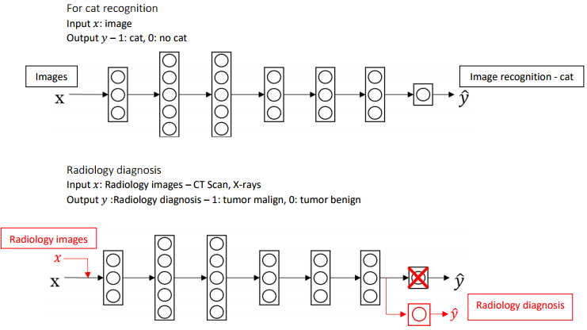

# Structuring Machine Learning Projects

# 第一周 Single number evaluation metric

### Intro

ML Strategy: 采取合适的ML项目构建策略，有利于快速有效的构建最优秀的项目。

**正交化（Orthogonalization）**的核心在于每次调整只会影响模型某一方面的性能，而对其他功能没有影响。这种方法有助于更快更有效地进行机器学习模型的调试和优化。

在机器学习（监督学习）系统中，可以划分四个“功能”：

1. 建立的模型在训练集上表现良好；
2. 建立的模型在验证集上表现良好；
3. 建立的模型在测试集上表现良好；
4. 建立的模型在实际应用中表现良好。

其中，

- 对于第一条，如果模型在训练集上表现不好，可以尝试训练更大的神经网络或者换一种更好的优化算法（例如 Adam）；
- 对于第二条，如果模型在验证集上表现不好，可以进行正则化处理或者加入更多训练数据；
- 对于第三条，如果模型在测试集上表现不好，可以尝试使用更大的验证集进行验证；
- 对于第四条，如果模型在实际应用中表现不好，可能是因为测试集没有设置正确或者成本函数评估指标有误，需要改变测试集或成本函数。

面对遇到的各种问题，正交化能够帮助我们更为精准有效地解决问题。

一个反例是[早停止法（Early Stopping）](http://kyonhuang.top/Andrew-Ng-Deep-Learning-notes/#/Improving_Deep_Neural_Networks/深度学习的实用层面?id=其他正则化方法)。如果早期停止，虽然可以改善验证集的拟合表现，但是对训练集的拟合就不太好。因为对两个不同的“功能”都有影响，所以早停止法不具有正交化。虽然也可以使用，但是用其他正交化控制手段来进行优化会更简单有效。

### **模型评价** a single number evaluation metric

对于我们所建立的算法模型的结果，我们需要一定的评价指标。

比如分类问题，a single number evaluation metric（**单值评价指标**）是一个有效的方法。

$F_1$是一个衡量了Precision和Recell两方面的指标,比单纯的平均数效果要好。

公式如
$$
F_1 = \frac{2}{  \frac{1}{P} + \frac{1}{R} }
$$
其图像类似与：

在比如对于多个数据集上的表现，平均值是一个不错的评价方法。

通过引入单值评价指标，我们可以更方便快速地对不同模型进行比较。

### 优化指标和满足指标

如果我们还想要将分类器的运行时间也纳入考虑范围，将其和精确率、召回率组合成一个单值评价指标显然不那么合适。这时，我们可以将某些指标作为**优化指标（Optimizing Matric）**，寻求它们的最优值；而将某些指标作为**满足指标（Satisficing Matric）**，只要在一定阈值以内即可。

在这个例子中，准确率就是一个优化指标，因为我们想要分类器尽可能做到正确分类；而运行时间就是一个满足指标，如果你想要分类器的运行时间不多于某个阈值，那最终选择的分类器就应该是以这个阈值为界里面准确率最高的那个

再者，根据现实的需求或者在实际应用中的表现能力与评价指标不匹配，我们可以动态改变一下评价指标。

### Train/dev/test distributions

​	假设训练集合和交叉验证集的数据分布的来源不一致，就好比我们的训练的时候瞄准了一个靶心，而在另一个训练集上靶子放在了另一个地方，你的优化方向很可能都是无用功。

所有我们需要将所有数据Randomly shuffle into dev/test。

数据集应该和	机器学习系统将要在实际应用中面对的数据一致，且必须从所有数据中随机抽取。这样，系统才能做到尽可能不偏离目标。

### Size of the dev and test sets

过去数据量较小（小于 1 万）时，通常将数据集按照以下比例进行划分：

- 无验证集的情况：70% / 30%；
- 有验证集的情况：60% / 20% / 20%；

这是为了保证验证集和测试集有足够的数据。现在的机器学习时代数据集规模普遍较大，例如 100 万数据量，这时将相应比例设为 98% / 1% / 1% 或 99% / 1% 就已经能保证验证集和测试集的规模足够。

**Guildline**

测试集的大小应该设置得足够提高系统整体性能的可信度，验证集的大小也要设置得足够用于评估几个不同的模型。应该根据实际情况对数据集灵活地进行划分，而不是死板地遵循老旧的经验。

## Comparing to human-level performance

很多机器学习模型的诞生是为了取代人类的工作，因此其表现也会跟人类表现水平作比较。

上图展示了随着时间的推进，机器学习系统和人的表现水平的变化。一般的，当机器学习超过人的表现水平后，它的进步速度逐渐变得缓慢，最终性能无法超过某个理论上限，这个上限被称为**贝叶斯最优误差（Bayes Optimal Error）**。

贝叶斯最优误差一般认为是理论上可能达到的最优误差，换句话说，其就是理论最优函数，任何从 x 到精确度 y 映射的函数都不可能超过这个值。例如，对于语音识别，某些音频片段嘈杂到基本不可能知道说的是什么，所以完美的识别率不可能达到 100%。

因为人类对于一些自然感知问题的表现水平十分接近贝叶斯最优误差，所以当机器学习系统的表现超过人类后，就没有太多继续改善的空间了。

也因此，只要建立的机器学习模型的表现还没达到人类的表现水平时，就可以通过各种手段来提升它。例如采用人工标记过的数据进行训练，通过人工误差分析了解为什么人能够正确识别，或者是进行偏差、方差分析。

当模型的表现超过人类后，这些手段起的作用就微乎其微了。

### Avoidable bias

通过与贝叶斯最优误差，或者说，与人类表现水平的比较，可以表明一个机器学习模型表现的好坏程度，由此判断后续操作应该注重于减小偏差还是减小方差。

模型在**训练集**上的误差与人类表现水平的差值被称作**可避免偏差（Avoidable Bias）**，交叉验证集中的误差与训练集的误差之间的差值称为Variance	。可避免偏差低便意味着模型在训练集上的表现很好，而**训练集与验证集之间错误率的差值**越小，意味着模型在验证集与测试集上的表现和训练集同样好。

如果**可避免偏差**大于**训练集与验证集之间错误率的差值**，之后的工作就应该专注于减小偏差；反之，就应该专注于减小方差。

### Understanding human-level performance

我们使用Human-level performance 作为 贝叶斯最优误差的的一个代理，由此来分析 Training error 和 Dev error的表象。如下图所示， 第一个例子中的 可避免误差明显大于Variance，所以我们应注重于改善bias问题，第二个例子中Variance明显大于可避免误差，所以我们应该集中助力于Variance问题上。

'但是，当机器学习模型的表现超过了人类水平误差时，很难再通过人的直觉去判断模型还能够往什么方向优化以提高性能。

### Surpassing human-level performance 

人类一般很擅长 natural percition problem，而机器更容易处理非自然感觉问问题。如果拥有足够的数据，很多深度学习学习也可以在自然感觉问题上达到甚至超过人类水平。这真的很让人期待。

### 总结

想让一个监督学习算法达到使用程度，应该做到以下两点：

1. 算法对训练集的拟合很好，可以看作可避免偏差很低；
2. 推广到验证集和测试集效果也很好，即方差不是很大。

### 评分测验 

​	错题： 

5. After setting up your train/dev/test sets, the City Council comes across another 1,000,000 images, called the “citizens’ data”. Apparently the citizens of Peacetopia are so scared of birds that they volunteered to take pictures of the sky and label them, thus contributing these additional 1,000,000 images. These images are different from the distribution of images the City Council had originally given you, but you think it could help your algorithm.

   You should not add the citizens’ data to the training set, because this will cause the training and dev/test set distributions to become different, thus hurting dev and test set performance. True/False?

   > （1）数据能不能放在test set上？不行，会造成一定的Covariate Shift，并且，测试集要能直接反应现实目标，本模型的目标是要识别出鸟，所以测试集一定是测试识别鸟。
   >
   > （2）数据能不能放在Training set上？可以，训练集数据和Dev set, Test set可以不同，从长期来看，训练集更广泛能够让模型拥有更好的泛化能力，以及更加robust。
   >
   >

6. ou also evaluate your model on the test set, and find the following:

   - Human-level performance 0.1%
   - Training set error 2.0%
   - Dev set error 2.1%
   - Test set error 7.0%

   What does this mean? (Check the two best options.)

   - You should try to get a bigger dev set.
   - You have overfit to the dev set.

   > 明确一点，分析模型表现能力，首先查看训练集、然后交叉验证集，最后查看测试集。
   >
   > 具体分析：这个模型的Training set error 和  Dev set error 很小，而且相当接近，但是Test set error 非常的大； 这说明了这个模型在Dev set 过拟合了，所以在Test set上表现不佳。针对于此，我们需要调整Dev sets 的大小，来重新测试模型的Dev的表现能力。
   >
   > 为什么不是Test的数据过小导致无法体现模型的能力呢？因为一个表现优秀的模型应该对于任何或者绝绝大多数（7%的数据显然与2%相比过大了）的样例都能成功识别出来，只有过拟合的模型才表现仅在Test Set上表现不佳。

   11. You’ve handily beaten your competitor, and your system is now deployed in Peacetopia and is protecting the citizens from birds! But over the last few months, a new species of bird has been slowly migrating into the area, so the performance of your system slowly degrades because your data is being tested on a new type of data.

       - Use the data you have to define a new evaluation metric (using a new dev/test set) taking into account the new species, and use that to drive further progress for your team.

       > 首先新出出现的鸟类图片数量过少，按照原来数据分配的百分比98%， 1%， 1%， Dev set 和 Test Dev 只能 各自分到 10张照片。这显然不能让模型有效的学习到内容。
       >
       > 其次为了快速解决问题， 显然（只能）题目的解答更好，

   15. The City Council thinks that having more Cats in the city would help scare off birds. They are so happy with your work on the Bird detector that they also hire you to build a Cat detector. (Wow Cat detectors are just incredibly useful aren’t they.) Because of years of working on Cat detectors, you have such a huge dataset of 100,000,000 cat images that training on this data takes about two weeks. Which of the statements do you agree with? (Check all that agree.)

       - If 100,000,000 examples is enough to build a good enough Cat detector, you might be better of training with just 10,000,000 examples to gain a ≈10x improvement in how quickly you can run experiments, even if each model performs a bit worse because it’s trained on less data.
       - Buying faster computers could speed up your teams’ iteration speed and thus your team’s productivity.
       - Needing two weeks to train will limit the speed at which you can iterate.

       > 第一个选项：为什么即使会产生更差的参数也要分开训练？因为1/10样本仍有原来100M数据的足够信息量，也就是说新抽样的数据带有原来数据的信息；同时减少训练数量可以加快训练速度，那么我们可以尝试更多的参数以获取更优的参数。

7. 

8. 2

## 补充资料 

**What is Covariate shift?**

An example：If you are building a neural network (or any other classifier for that matter), and if you train your classifier by showing examples of all black cats, then the performance of that classifier will not be so great when it is presented with pictures of non-black cats.

The reason is that the **distribution of the pixel intensity vector has shifted considerably**. And this will be true even if the original nonlinear decision boundary remains unchanged between the positive and negative examples.

用更数学化的方式表示，在 ![[公式]](Structuring Machine Learning Projects.assets/equation.svg)这个过程中，Covariate shift 问题就是 $P_{train}(y|x) = P_{test}(y|x))$， 但是 	$P_{train}(X) \neq P_{test}(x)$ 

这篇[文章](Batch Normalization: Accelerating Deep Network Training by Reducing Internal Covariate Shift)中提到了 Batch  Normalization 可以缓解Covariate shift 问题，从而加速深度学习网络的问题。（2019-12）

# 第二周 

## Error Analysis

错误分析旨在DEV SET中的标记错误的数据进行分析，并判断哪些方面的数据出错了，并且分析出各出错类型数据的比例。

这时，我们可以从分类错误的样本中统计出狗的样本数量。根据狗样本所占的比重来判断这一问题的重要性。假如狗类样本所占比重仅为 5%，那么即使花费几个月的时间来提升模型对狗的识别率，改进后的模型错误率并没有显著改善；而如果错误样本中狗类所占比重为 50%，那么改进后的模型性能会有较大的提升。因此，花费更多的时间去研究能够精确识别出狗的算法是值得的。

这种人工检查看似简单而愚笨，但却是十分必要的，因为这项工作能够有效避免花费大量的时间与精力去做一些对提高模型性能收效甚微的工作，让我们专注于解决影响模型准确率的主要问题。

在对输出结果中分类错误的样本进行人工分析时，可以建立一个表格来记录每一个分类错误的具体信息，例如某些图像是模糊的，或者是把狗识别成了猫等，并统计属于不同错误类型的错误数量。这样，分类结果会更加清晰。

总结一下，进行错误分析时，你应该观察错误标记的例子，看看假阳性和假阴性，统计属于不同错误类型的错误数量。在这个过程中，你可能会得到启发，归纳出新的错误类型。总之，通过统计不同错误标记类型占总数的百分比，有助于发现哪些问题亟待解决，或者提供构思新优化方向的灵感。

### Cleaning up incorrectly labeled data

我们用 mislabeled examples 来表示学习算法输出了错误的 Y 值。而在做误差分析时，有时会注意到数据集中有些样本被人为地错误标记（incorrectly labeled）了，这时该怎么做？

如果是在训练集中，由于机器学习算法对于随机误差的**稳健性（Robust）**（也称作“鲁棒性”），只要这些出错的样本数量较小，且分布近似随机，就不必花费时间一一修正。

而如果出现在验证集或者测试集，则可以在进行误差分析时，通过统计人为标记错误所占的**百分比**，来大致分析这种情况对模型的识别准确率的影响，并比较该比例的大小和其他错误类型的比例，以此判断是否值得去将错误的标记一一进行修正，还是可以忽略。

当你决定在验证集和测试集上手动检查标签并进行修正时，有一些额外的方针和原则需要考虑：

- 在验证集和测试集上**同时使用同样的修正手段**，以保证验证集和测试集来自相同的分布；
- 同时检查判断正确和判断错误的例子（通常不用这么做）；
- 在修正验证集和测试集时，鉴于训练集的分布可以和验证/测试集略微不同，可以不去修正训练集。

### 快速搭建系统并迭代

对于每个可以改善模型的合理方向，如何选择一个方向集中精力处理成了问题。如果想搭建一个全新的机器学习系统，建议根据以下步骤快速搭建好第一个系统，然后开始迭代：

1. 设置好训练、验证、测试集及衡量指标，确定目标；

2. 快速训练出一个初步的系统，用训练集来拟合参数，用验证集调参，用测试集评估；

3. 通过偏差/方差分析以及错误分析等方法，决定下一步优先处理的方向。

## Mismatched training and dev/test set

### Training and testing on different distribution

有时，我们很难得到来自同一个分布的训练集和验证/测试集。还是以猫识别作为例子，我们的训练集可能由网络爬取得到，图片比较清晰，而且规模较大（例如 20 万）；而验证/测试集可能来自用户手机拍摄，图片比较模糊，且数量较少（例如 1 万），难以满足作为训练集时的规模需要。

虽然验证/测试集的质量不高，但是机器学习模型最终主要应用于识别这些用户上传的模糊图片。考虑到这一点，在划分数据集时，可以将 20 万张网络爬取的图片和 5000 张用户上传的图片作为训练集，而将剩下的 5000 张图片一半作验证集，一半作测试集。比起混合数据集所有样本**再随机划分(shuffle)**，这种分配方法虽然使训练集分布和验证/测试集的分布并不一样，但是能保证**验证/测试集更接近实际应用场景**，在长期能带来更好的系统性能。

##  

### Bias and Variance with mismatched data distributions

​         在之前的问题中，我们讨论了人类最优误差、训练集误差、验证集误差以及测试集误差。我们通过三者误差可以讨论出模型的Bias和Variance情况。但这之时在三个数据集分布一致的前提，为了讨论训练集和验证集、测试集数据分布不一致的情况，我们定义一个 Train-Dev set。这个数据集拥有和训练集一致的数据分布，但是不参与模型训练。

现在，我们有了*训练集*错误率、*训练-验证集*错误率，以及*验证集*错误率。其中，*训练集*错误率和*训练-验证集*错误率的差值反映了方差；而*训练-验证集*错误率和*验证集*错误率的差值反映了样本分布不一致的问题，从而说明**模型擅长处理的数据和我们关心的数据来自不同的分布**，我们称之为**数据不匹配（Data Mismatch）**问题。

人类水平误差、*训练集*错误率、*训练-验证集*错误率、*验证集*错误率、*测试集*错误率之间的差值所反映的问题如下图所示：

### Addressing data mismatch

这里有两条关于如何解决数据不匹配问题的建议：

- 做错误分析，尝试了解训练集和验证/测试集的具体差异（主要是人工查看训练集和验证集的样本）；
- 尝试将训练数据调整得更像验证集，或者收集更多类似于验证/测试集的数据。

如果你打算将训练数据调整得更像验证集，可以使用的一种技术是**人工合成数据**。我们以语音识别问题为例，实际应用场合（验证/测试集）是包含背景噪声的，而作为训练样本的音频很可能是清晰而没有背景噪声的。为了让训练集与验证/测试集分布一致，我们可以给训练集人工添加背景噪声，合成类似实际场景的声音。

人工合成数据能够使数据集匹配，从而提升模型的效果。但需要注意的是，不能给每段语音都增加同一段背景噪声，因为这样模型会对这段背景噪音出现过拟合现象，使得效果不佳。

## Learning from multiple tasks

### Transfer learning

**迁移学习（Tranfer Learning）**是通过将已训练好的神经网络模型的一部分网络结构应用到另一模型，将一个神经网络从某个任务中学到的知识和经验运用到另一个任务中，以显著提高学习任务的性能。

例如，我们将为猫识别器构建的神经网络迁移应用到放射科诊断中。因为猫识别器的神经网络已经学习到了有关图像的结构和性质等方面的知识，所以只要先删除神经网络中原有的输出层，加入新的输出层并随机初始化权重系数（$W^{[L]}$、$b^{[L]}$），随后用新的训练集进行训练，就完成了以上的迁移学习。

如果新的数据集很小，可能只需要重新训练输出层前的最后一层的权重，即$W^{[L]}$、$b^{[L]}$，并保持其他参数不变；而如果有足够多的数据，可以只保留网络结构，重新训练神经网络中所有层的系数。这时初始权重由之前的模型训练得到，这个过程称为**预训练（Pre-Training）**，之后的权重更新过程称为**微调（Fine-Tuning）**。

你也可以不止加入一个新的输出层，而是多向神经网络加几个新层。

在下述场合进行迁移学习是有意义的：

1. 两个任务有同样的输入（比如都是图像或者都是音频）；
2. **拥有更多数据的任务迁移到数据较少的任务**；
3. 某一任务的低层次特征（底层神经网络的某些功能）对另一个任务的学习有帮助。

### 多任务学习 Multi-Task Learning

迁移学习中的步骤是串行的；而**多任务学习（Multi-Task Learning）**使用单个神经网络模型，利用共享表示采用并行训练同时学习多个任务。多任务学习的基本假设是**多个任务之间具有相关性**，并且任务之间可以利用相关性相互促进。例如，属性分类中，抹口红和戴耳环有一定的相关性，单独训练的时候是无法利用这些信息，多任务学习则可以利用任务相关性联合提高多个属性分类的精度。

以汽车自动驾驶为例，需要实现的多任务是识别行人、车辆、交通标志和信号灯。如果在输入的图像中检测出车辆和交通标志，则输出的 y 为：

多任务学习模型的成本函数为：

其中，j 代表任务下标，总有 c 个任务。对应的损失函数为：

多任务学习是使用单个神经网络模型来实现多个任务。实际上，也可以分别构建多个神经网络来实现。多任务学习中可能存在训练样本 Y 某些标签空白的情况，这不会影响多任务学习模型的训练。

多任务学习和 Softmax 回归看上去有些类似，**容易混淆。**它们的区别是，Softmax 回归的输出向量 y 中只有一个元素为 1；而多任务学习的输出向量 y 中可以有多个元素为 1。

在下述场合进行多任务学习是有意义的：

1. 训练的一组任务可以共用低层次特征；
2. *通常*，每个任务的数据量接近；
3. 能够训练一个足够大的神经网络，以同时做好所有的工作。多任务学习会降低性能的唯一情况（即和为每个任务训练单个神经网络相比性能更低的情况）是**神经网络还不够大**。

在多任务深度网络中，低层次信息的共享有助于**减少计算量**，同时共享表示层可以使得几个有共性的任务更好的**结合相关性信息**，任务特定层则可以单独建模任务特定的信息，实现共享信息和任务特定信息的统一。

在实践中，多任务学习的使用频率要远低于迁移学习。计算机视觉领域中的物体识别是一个多任务学习的例子。

## End-to-end deep learning

### What's end-to-end deep learning?

在传统的机器学习分块模型中，每一个模块处理一种输入，然后其输出作为下一个模块的输入，构成一条流水线。而**端到端深度学习（End-to-end Deep Learning）**只用一个单一的神经网络模型来实现所有的功能。它将所有模块混合在一起，只关心输入和输出。

如果数据量较少，传统机器学习分块模型所构成的流水线效果会很不错。但如果训练样本足够大，并且训练出的神经网络模型足够复杂，那么端到端深度学习模型的性能会比传统机器学习分块模型更好。

而如果数据集规模适中，还是可以使用流水线方法，但是可以混合端到端深度学习，通过神经网络绕过某些模块，直接输出某些特征。

Andrew提到两个例子：一个是端到端的语音识别，另一个是两者端到端系统的结合组成的项目----人脸识别。在第二例子中， 第一个模型负责选择图像中的人脸，第二种模型负责对比人脸。可以看到这两个模型负责了两个不同的任务，在不同的信息中得到了有效的结果。也是从一个角度说明了，有效的数据对于构建深度学习网络的重要性。

### Whether to use end-to-end deep learning

应用端到端学习的优点：

- 只要有足够多的数据，剩下的全部交给一个足够大的神经网络。比起传统的机器学习分块模型，可能更能捕获数据中的任何统计信息，而不需要用人类固有的认知（或者说，成见）来进行分析；
- 所需手工设计的组件更少，简化设计工作流程；

缺点：

- 需要大量的数据；
- 排除了可能有用的人工设计组件；

根据以上分析，决定一个问题是否应用端到端学习的**关键点**是：是否有足够的数据，支持能够直接学习从 x 映射到 y 并且足够复杂的函数？

## 错题

1. **You are just getting started on this project. What is the first thing you do? Assume each of the steps below would take about an equal amount of time (a few days).**

   Spend a few days training a basic model and see what mistakes it makes.

   > As discussed in lecture, applied ML is a highly iterative process. If you train a basic model and carry out error analysis (see what mistakes it makes) it will help point you in more promising directions.

8. n this table, 4.1%, 8.0%, etc.are a fraction of the total dev set (not just examples your algorithm mislabeled). I.e. about 8.0/14.3 = 56% of your errors are due to foggy pictures.

   The results from this analysis implies that the team’s highest priority should be to bring more foggy pictures into the training set so as to address the 8.0% of errors in that category. True/False?

    **False** because this would depend on how easy it is to add this data and how much you think your team thinks it’ll help. 

9. You decide to use data augmentation to address foggy images. You find 1,000 pictures of fog off the internet, and “add” them to clean images to synthesize foggy days, like this:

   Which of the following statements do you agree with? (Check all that apply.)

- So long as the synthesized fog looks realistic to the human eye, you can be confident that the synthesized data is accurately capturing the distribution of real foggy images, since human vision is very accurate for the problem you’re solving.

> If the synthesized images look realistic, then the model will just see them as if you had added useful data to identify road signs and traffic signals in a foggy weather. I will very likely help.

​	

Note: 	

Dev sets 和 Test set的数据分布问题: it is important that your dev and test set have the closest possible distribution to “real”-data. It is also important for the training set to contain enough “real”-data to avoid having a data-mismatch problem.

能否根据在Train set 和 Test set的表现判断两个不同数据分布的分布的难易程度？

如何判断？

The algorithm does better on the distribution of data it trained on. But you don’t know if it’s because it trained on that no distribution or if it really is easier. To get a better sense, measure human-level error separately on both distributions.

为什么在Trian set 可以放置其他与实际应用的场景中的数据分布不一样的数据呢？

Deep learning algorithms are quite robust to having slightly different train and dev distributions.

为什么要保持Dev set 和 Test Set 中的数据分布一致？

Because you want to make sure that your dev and test data come from the same distribution for your algorithm to make your team’s iterative development process is efficient.