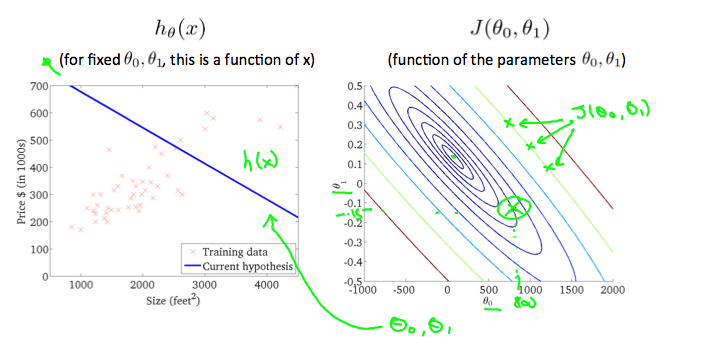
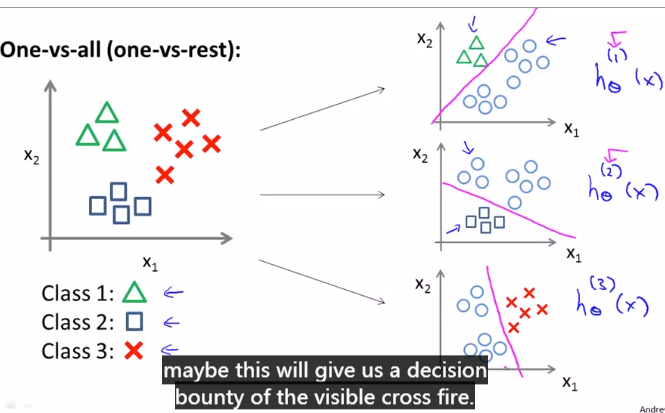
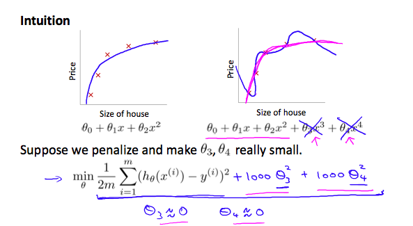

[toc]

# 机器学习笔记
# 作业地址
[github作业地址](https://github.com/Ruth-Seven/Mechine-Learning)

仅仅是简单的了解是不够的的，还需要严密的推导和切身的实践。---米开朗琪杰

# 第一周

其他内容

## Model Represenetation

To describe teh supervised learning problem, our goal is given a training set,to learn a function $h:x->y$.  So that $h(x)$ can predict y by the value of x.The process is therefore like this:

### Cost function

We can measure the accuracy of our hypothsis function by using a cost function. 	
$$
J(\theta)=\frac{1}{2m}\sum_{i=1}^m(h_\theta(x^{(i)})-y^{(i)})^2
$$
$\sum_{i=1}^m(h_\theta(x^{(i)})-y^{(i)})^2x$ is the mean of the squares of $h_\theta(x^{(i)})-y^{(i)}$,or the difference between the predicted value ans the actual value.

This function is also called the "Squared error function", or "Mean squared error".

A contour plot(等高线图) is a graph that contains many contour lines. A contour line of a two variable function has a constant value at all points of the same line. An example of such a graph is the one to the right below.

### Gradient Desent

We can graph our hypothesis function based on its fields $\theta_0$ and $\theta_1$.The red arrows shows the minimum points in the graph where our cost function is at the very bottom of the pits.

The way to reach the minimum points is by taking the derivative(the tangential line to a function) of our cost function. The slope of the tangent is the derivative at that point  and it will give us a direction to move towards. We make steps down the cost function in the direction with he steepest descent. The size of each step is determined by the parameter $\alpha$, which is called the learning rate.

**The gradient descent algorithm is:**

repeat until convergence:
$$
\theta_j:=\theta_j-\alpha\frac{\partial}{\partial\theta_j}J(\theta_0,\theta_1)
$$

where j=0,1 represents the feature index number.

Note, at each iteration j, the parameters should be updated as a whole rather that one by one.

# 第二周

## Multivariate Linear Regression

###  Multiple Features

#### 符号简记

the lowercase "n" is the number of features. Rather than 'm' is the number of rows on this table or the number of training examples.

we are going to use X superscript "i" such as $X^{i}$, to denote the input features "i" training example. As a concrete example, $X^2$ is going to be a vector of the second row of this table.

Secondly, we are going to use also $X_j^{i}$ to denote the value of the feature number J  and the training example.

### Hypothesis of multivariate linear regression 

Firstly, let define $x_0$ to  be equals one;
$$
H(\theta)=\theta_0x_0+\theta_1x_1+\theta_2x_2+\cdots+\theta_{n-1}x_{n-1}+\theta_nx_n
$$
vector $\mathrm{x}=\begin{bmatrix} x_0 \\ x_1 \\\\ \vdots \\\\ x_n \end{bmatrix}$  $\mathrm{\theta}=\begin{bmatrix} \theta_0 \\ \theta_1 \\\\ \vdots \\\\ \theta_n \end{bmatrix}$ , the excrpt of the notation let us write this in this compact form. 
$$
H(\theta)=\theta^\mathrm Tx
$$

### The gradient descent for linear regression with multiple features

To quickly summarize our notation, this is our formal hypothesis in multivariable linear regression where we've adopted the convention that x0=1.The parameters of this model are theta0 through theta n, but instead of thinking of this as n separate parameters, which is valid, I'm instead going to think of the parameters as theta where theta here is a n+1-dimensional vector. 

Cost function:
$$
J(\theta)=\frac{1}{2m}\sum_{i=1}^m(h_\theta(x^{(i)})-y^{(i)})^2
$$
Gradient descent:
$$
\theta_0:= \theta_0-\alpha\frac{1}{m}\sum_{i=1}^{m}(h_\theta(x^{(i)})-y^{(i)}))x_0^{(i)}
$$

$$
\theta_1:= \theta_1-\alpha\frac{1}{m}\sum_{i=1}^{m}(h_\theta(x^{(i)})-y^{(i)}))x_1^{(i)}
$$

$$
\cdots
$$

上述公式中的$x_0$=1, 故可化简。

补充，cost function的偏导可求，即梯度下降公式的一部分。

### Gradient Descent in Practice 1-Feature Scaling

Because $\theta$ will descend quickly on small ranges and slowly on large ranges,  we can s[eed up gradient descent by having each of input valuse in roughly the same range.

Two techniques to help with this are **feature scaling** and **mean normalization**. Feature scaling just involves dividing the inputs by the range, resulting in a nwe range of just 1.
$$
x_i=\frac{x_i}{R_i}\\\\
R_i=\max{x_i}-\min{x_i}
$$
More importantly, mean normalization involves subtracting the average value of input valuse resulting in a new average value for the input variable just zero.
$$
x_i=\frac{x_i-\mu_i}{s_i}\\\\
$$
Where $\mu_i$ is the  average of all the values for feature(i) ans $s_i$ is **the range of values(max-min)** or $s_i$ is the **standard deviation.**（标准差）

### Gradient Descent in Practice 2-Learning rate

1. Making a plot with the number of iterations on the x-axis shows the changes of cost function. If $J(\theta)$ ever increases, then we should decrease $\alpha$.
2. Declaring convergence if $J(\theta)$ decreases by less than $\varepsilon$ ,which is small value such as $10^{-3}$.However in practice it's difficult to choose the threshold value.

To summarize:

If $\alpha$ is too small: slow convergence.

If  $\alpha$ is too large: may not decrease on every iteration and thus may not converge.

### Features and Polynomial Regression

We can improve the preformce of  our hypothesis by combining multiple feathers into one or adding a featuer to another one.

For example, 
$$
H(\theta)=\theta_0x_0+\theta_1(x_1+x_2)+\theta_3x_3^2+\theta_4\sqrt{x_4}\\\\
=\theta_0t_0+\theta_1t_1+\theta_3t_2+\theta_4t_3
$$
One important thing to keep in mind is, if you choose your features this way **then feature scaling becomes very important.**eg. if $x_1$ has range 1 - 1000 then range of $x_1$,$x_2$ becomes 1 - 1000000 and that of $x_1^3$becomes 1 - 1000000000.

## Computing Parameters Analytically

### Normal Equation

$\theta$ is a vector of  $\theta_0$，$\theta_1$$\cdots$$\theta_n$.
$$
\theta=(X^\mathrm{T}X)^{-1}X^\mathrm{T}y
$$
Matalb: 	`pinv(x'*x)*x'y`

Solutions to the above problems include deleting a feature that is linearly dependent with another or deleting one or more features when there are too many features.	

# 第三周

## Classification

To attempt classification, one method is to use linear regression and map all predictions greater than 0.5 as a 1 and all less than 0.5 as a 0. However, this method doesn't work well because classification is not actually a linear function.

The classification problem is just like the regression problem, except that the values we now want to predict take on only a small number of discrete values. For now, we will focus on the **binary classification** **problem** 

### Logistics Regression Model

$$
h_\theta=g(\theta^{\mathrm{T}}x)
$$

g() is Sigmoid function or Logistic function.
$$
g(z)=\frac{1}{1+e^{-z}}
$$

$h_\theta(x)$ = estimated probability that y = 1 on input x $=P(y=1|x;\theta)$.

$P(y=1|x;\theta) + P(y=0|x;\theta) = 1$ is obvious.

 

#### **How to predict** 

#### **Decision Boundary**

Q:How to decide which part is denote 1?

Non-linear decision boundary

#### Cost Function

**non-convex function** 

**Logistic  regression cost function**
$$
Cost(h_\theta(x^{(i)},y^{(i)})) = 
\begin{cases}
	-log(h_\theta(x)),\quad \text{if y = 1}\\
	-log(1 - h_\theta(x)),\quad \text{if y = 0}\\	
\end{cases}\\\\
=-ylog(h_\theta(x)) - (1-y)log_\theta(1-h_\theta(x))
$$
THE amazing function look like that:

If  y = 1 and $h_\theta(x)=1$, Cost = 0. But as $h_\theta(x)\rightarrow0$, $Cost\rightarrow\infty$(we penalize learning algorithm by a very lager cost ).Note that writing the cost function in this way guarantees that J(θ) is **convex** for logistic regression.

凸优化问题比非凸优化问题更容易解决！

#### Gradient Descent

Logistics regression algorithm is similar with linear regression. We still have to simultaneously update all values in theta.A vectorized implementation is:

损失函数的微分推导不是一眼看出的：h(x)带入 logistics函数$g(X^\mathrm{T}\theta)$，求导即可。

By the way, **features scaling** is also applied in the logistics regression model.

##### Advanced Optimization

There are a lot of advanced optimization algorithms.

"Conjugate gradient", "BFGS", and "L-BFGS" are more sophisticated, faster ways to optimize θ that can be used instead of gradient descent. We suggest that you should not write these more sophisticated algorithms yourself (unless you are an expert in numerical computing) but use the libraries instead, as they're already tested and highly optimized. **Octave provides them.**

##### IMPORTANT LECTURE

An exmaple about how to use the fminunc and the meaning of all part of option is illustrated.

(exitflag = 1 ：正常迭代退出； )

## Multiclas Classification

### One vs alll

分解任务

数学模型

## Solving the Problem of  Overfitting

Without formally defining what these terms mean, we’ll say the figure on the left shows an instance of **underfitting**, or high bias—in which the data clearly shows structure not captured by the model—and the figure on the right is an example of **overfitting**, high variance.

This terminology is applied to both linear and logistic regression. There are two main options to address the issue of overfitting:

1) Reduce the number of features:

- Manually select which features to keep.
- Use a model selection algorithm (studied later in the course).

2) Regularization（正规化）

- Keep all the features, but reduce the magnitude of parameters $\theta_j$.
- Regularization works well when we have a lot of slightly useful features.

### Cost Function

If we have overfitting from our hypothesis function, we can reduce the weight that some of the terms in our function carry by increasing their cost.

Say we wanted to make the following function more quadratic:

$\theta_0 + \theta_1x + \theta_2x^2 + \theta_3x^3 + \theta_4x^4$

We'll want to eliminate the influence of $\theta_3x^3$  and  $\theta_4x^4$ . Without actually getting rid of these features or changing the form of our hypothesis, we can instead modify our **cost function**:

$min_\theta\ \dfrac{1}{2m}\sum_{i=1}^m (h_\theta(x^{(i)}) - y^{(i)})^2 + 1000\cdot\theta_3^2 + 1000\cdot\theta_4^2$

More Generally, 引入一个惩罚项来平衡拟合和过拟合。We could also regularize all of our theta parameters in a single summation as:

Using the above cost function with the extra summation, we can smooth the output of our hypothesis function to reduce overfitting. If lambda is chosen to be **too large**, **it may smooth out the function too much and cause underfitting.** Hence, what would happen if $\lambda$ = 0 or is too small ?

A: It does't work great.

### Regularized linear regression

#### Gradient Desent

We will modify our gradient descent function to separate out $\theta_0$ from the rest of the parameters because we do not want to penalize $\theta_0$.

The term $\theta_j(1-\alpha\frac{\lambda}{m})$ performs our regularization. With some manipulation our update rule can also be represented as illustrated.

The first term in the above equation,  $(1-\alpha\frac{\lambda}{m})$ will always be less than 1. Intuitively you can see it as reducing the value of $\theta_j$ by some amount on every update. Notice that the second term is now exactly the same as it was before.

#### Normal Equation (没听)

Now let's approach regularization using the alternate method of the non-iterative normal equation.

To add in regularization, the equation is the same as our original, except that we add another term inside the parentheses:

Recall that if m < n, then $X^TX$is non-invertible. However, when we add the term λ⋅L, then $X^TX + λ⋅L$ becomes invertible.

#### Regularized Logistic Regression

类似上文的线性回归的梯度下降方法，损失函数和梯度下降的修改都是类似的。

We can regularize logistic regression in a similar way that we regularize linear regression.

The following image shows how the regularized function, displayed by the pink line, is less likely to overfit than the non-regularized function represented by the blue line:

We can regularize this equation by adding a term to the end.The second sum, $\sum_{j=1}^n \theta_j^2$ **means to explicitly exclude** the bias term, $\theta_0$. I.e. the θ vector is indexed from 0 to n (holding n+1 values,   through $\theta_n$).Thus, when computing the equation, we should continuously update the two following equations:

#### Advanced optimization（ex2有编程练习哦）

Judge: Introducing regularization to the model always results in equal or better performance on the training set or not.

将正则化方法加入模型并不是每次都能取得好的效果,如果λ取得太大的化就会导致欠拟合. 这样不论对traing set 还是 examples都不好. 不正确.

​	

