# 机器学习笔记2
# 第四周

## Motivations

### Non-linear Hypotheses

Too much features in the problem of non-linear hypothese, such as the identity of cars in the pictures, can't be solved by any classifiers.

## Neural Networks

### Model Representation 1	


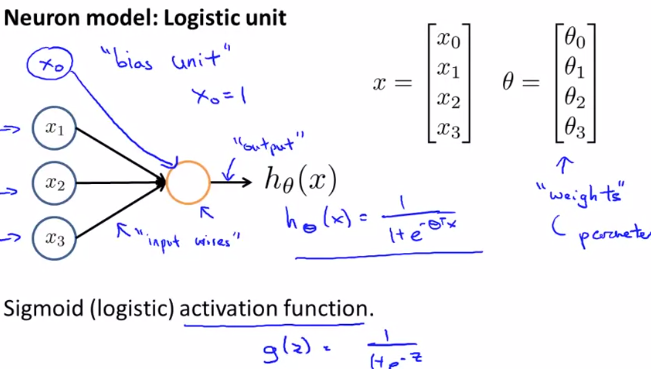

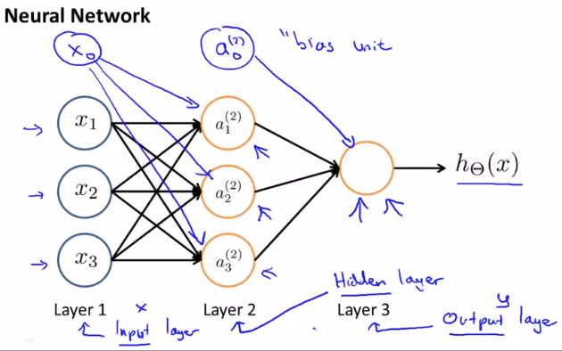

两层之间的神经元参数矩阵size是$S_{j+1} * (S_j + 1)$.( $S_j$ is the numbers of  units in layer j.)).The +1 comes from the addition in Θ(j) of the "bias nodes," $x_0$and $Θ(j)_0$. In other words the **output nodes will not include the bias nodes** while the inputs will. The following image summarizes our model representation:

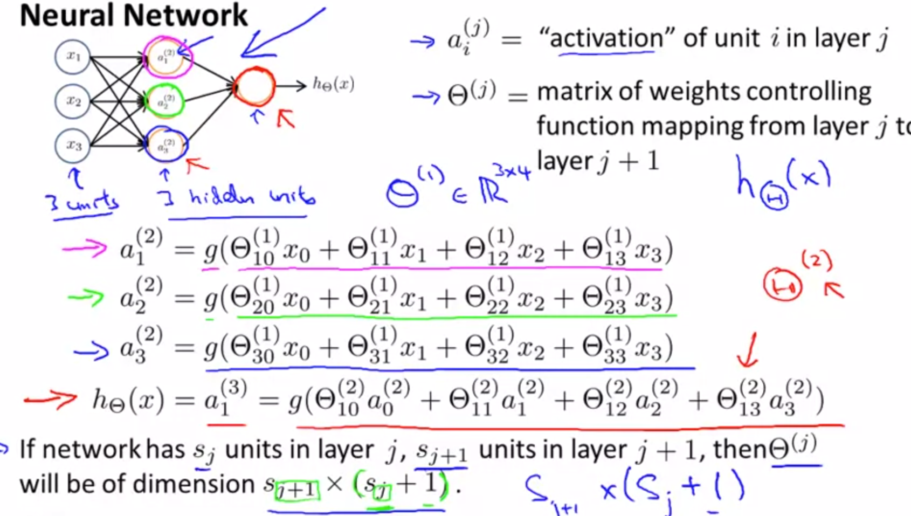


### Forward propagation:Vectorized its onw features

注意向前传播的公式计算可以矩阵向量化。(找找规律：上标（j）表示是第j层，下标j表示第j个单元)

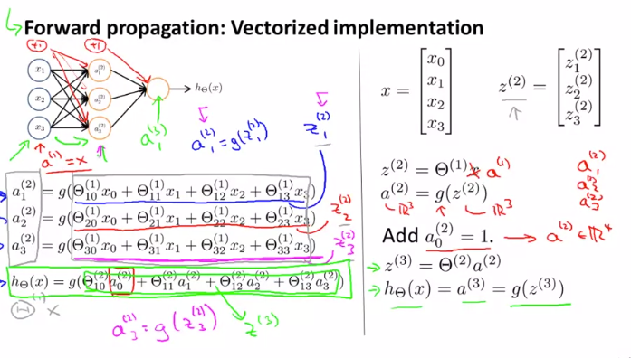

We are multiplying our matrix $Θ_{j-1}$ with dimensions $S_{j} * (S_{j-1}+1)$(where $s_j$ is the number of our activation nodes in layer $j$) by our **vector $a^{(j-1)}$ with** height (n+1). This gives us our vector $z^{(j)}$with height $s_j$. Now we can get a vector of our activation nodes for layer j as follows: $a^{(j)} = g(z^{(j)}) $

Notice that in this **last step**, between layer j and layer j+1, we are doing **exactly the same thing** as we did in **logistic regression**. Adding all these intermediate layers in neural networks allows us to more elegantly produce interesting and more complex non-linear hypotheses.

### **Example:OR function and so on**

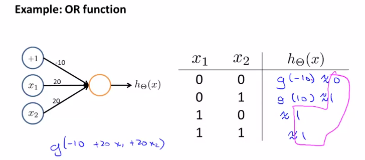

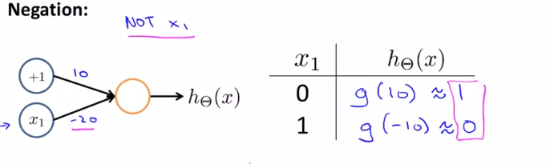

多个神经单元相结合可以得到更复杂的函数。XOR至少需要三层神经网络才能搭建。

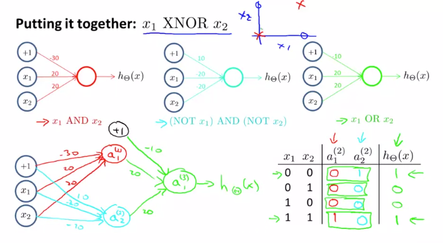

(RNN图像识别中)In which it takes its input this image, just takes this input, the raw pixels and the first hidden layer computes some set of features. The next hidden layer computes even more complex features and even more complex features. And these features can then be used by essentially the final layer of the logistic classifiers to make accurate predictions without the numbers that the network sees.

### Multiclass Classification

To classify data into multiple classes, we let our hypothesis function return a vector of values. Say we wanted to classify our data into one of four categories. We will use the following example to see how this classification is done. This algorithm takes as input an image and classifies it accordingly:

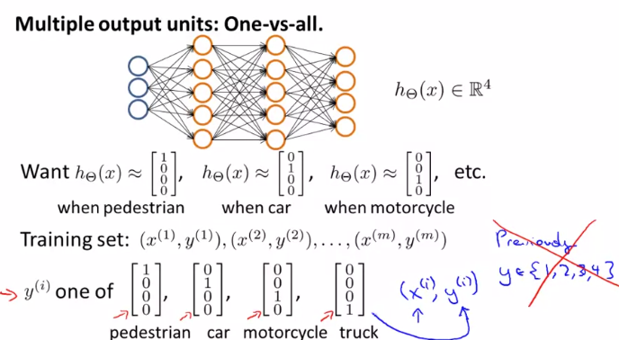

We can define our set of resulting classes as y. $y^{(i)}$ is a vector that represents the label of aim.

Each $y^{(i)}$ represents a different image corresponding to either a car, pedestrian, truck, or motorcycle. The inner layers, each provide us with some new information which leads to our final hypothesis function. The setup looks like:

# 第五周

##  5.1 Cost Function and Backpropagation

### Cost Function

Let's first define a few variables that we will need to use:

- L = total number of layers in the network
- $s_l$ = number of units (not counting bias unit) in layer l
- K = number of output units/classes

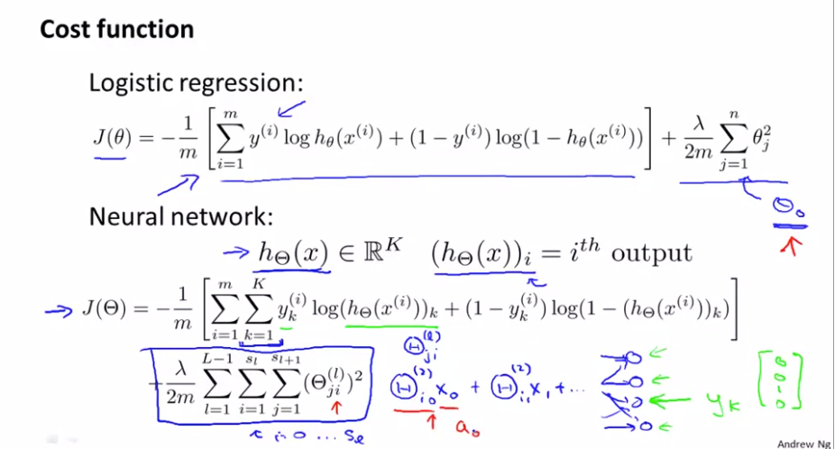

与罗杰斯特回归类似的的是，神经网络的随时函数也是将惩罚分类器的的误差，不过是神经网络有多个的分类器，且正规化项的包括了所有L-1个系数矩阵中的除i=0的系数。

Note:

- the double sum simply adds up the logistic regression costs calculated for each cell in the output layer
- the triple sum simply adds up the squares of all the individual Θs in the entire network.
- the i in the triple sum does **not** refer to training example i.

### Backpropagation Algorithm

"Backpropagation" is neural-network terminology for minimizing our cost function, just like what we were doing with gradient descent in logistic and linear regression. Our goal is to compute:

$min_ΘJ(Θ$)

That is, we want to minimize our cost function J using an optimal set of parameters in theta. In this section we'll look at the equations we use to compute the partial derivative of J(Θ):
$$
\frac{\partial}{\partialΘ_{i,j}^{(i)}}J(Θ)
$$


To do so, we use the following algorithm:


**Back propagation Algorithm**

Given training set {(*x*(1),*y*(1))⋯(*x*(*m*),*y*(*m*))}

- Set $\Delta^{(l)}_{i,j}:= 0$ for all (l,i,j), (hence you end up having a matrix full of zeros)

For training example t =1 to m:

1. Set $a^{(1)}$ := $x^{(t)}$
2. Perform forward propagation to compute $a^{(l)}$ for l=2,3,…,L


3. Using $y^{(t)}$, compute $\delta^{(L)} = a^{(L)} - y^{(t)}$ number of layers and $a^{(L)}$ is  the vector of outputs of the activation units for the last layer. So our "error values" for the last layer are simply the differences of our actual results in the last layer and the correct outputs in y. To get the delta values of the layers before the last layer, we can use an equation that steps us back from right to left:

4. Compute $\delta^{(L-1)},\delta^{(L-2)},\dots,\delta^{(2)}$using $δ(l)=((Θ(l))^T δ(l+1)) .∗ a(l) .∗ (1−a(l))$

   The delta values of layer l are calculated by multiplying the delta values in the next layer with the theta matrix of layer l. We then element-wise multiply that with a function called g', or g-prime, which is the derivative of the activation function g evaluated with the input values given by z^{(l)}*z*(*l*).

   The g-prime derivative terms can also be written out as: $g'(z^{(l)}) = a^{(l)}\ .*\ (1 - a^{(l)})$

5. $\Delta^{(l)}_{i,j} := \Delta^{(l)}_{i,j} + a_j^{(l)} \delta_i^{(l+1)}$ or with vectorization, $\Delta^{(l)} := \Delta^{(l)} + \delta^{(l+1)}(a^{(l)})^T$

Hence we update our new $\Delta$ matrix.The part which j != 0 is cumputed   by regularized.

- 

The capital-delta matrix D is used as an "accumulator" to add up our values as we go along and eventually compute our partial derivative. Thus we get 


## 5.2 Backpropagation in Practice

### Impementatio. Note: Unrolling Parameters

With neural networks, we are working with sets of matrices:

Θ(1),Θ(2),Θ(3),…

*D*(1),*D*(2),*D*(3),…

In order to use optimizing functions such as "fminunc()", we will want to "unroll" all the elements and put them into one long vector:

```matlab
thetaVector = [ Theta1(:); Theta2(:); Theta3(:);]
deltaVector = [ D1(:); D2(:); D3(:) ]
```

If the dimensions of Theta1 is 10x11, Theta2 is 10x11 and Theta3 is 1x11, then we can get back our original matrices from the "unrolled" versions as follows:

```matlab
Theta1 = reshape(thetaVector(1:110),10,11)
Theta2 = reshape(thetaVector(111:220),10,11)
Theta3 = reshape(thetaVector(221:231),1,11)
```

**To summarize:**


The advantage of the matrix representation is that when your parameters are stored as matrices it's more convenient when you're doing forward propagation and back propagation and it's easier when your parameters are stored as matrices to take advantage of the, sort of, vectorized implementations.

Whereas in contrast the advantage of the vector representation, when you have like thetaVec or DVec is that when you are using the advanced optimization algorithms. Those algorithms tend to assume that you have all of your parameters unrolled into a big long vector. And so with what we just went through, hopefully you can now quickly convert between the two as needed.

### Gradient Checking

Gradient checking will assure that our backpropagation works as intended. We can approximate the derivative of our cost function with:
$$
\frac{\partial}{\partial\Theta}J(\Theta)\approx\frac{J(\Theta+\epsilon)-J(\Theta-\epsilon)}{2\epsilon}
$$


With multiple theta matrices, we can approximate the derivative **with respect to** Θ*j* as follows:
$$
\frac{\partial}{\partial\Theta_j}J(\Theta)\approx\frac{J(\Theta_1,\cdots,\Theta_j+\epsilon,\cdots,\Theta_n)-J(\Theta_1,\cdots,\Theta_j+\epsilon,\cdots,\Theta_n)}{2\epsilon}
$$


A small value for *ϵ* (epsilon) such as *ϵ*=10−4, guarantees that the math works out properly. If the value for *ϵ* is too small, we can end up with numerical problems.

Hence, we are only adding or subtracting epsilon to the Θ*j* matrix. In octave we can do it as follows:

```matlab
epsilon = 1e-4;
for i = 1:n,
  thetaPlus = theta;
  thetaPlus(i) += epsilon;
  thetaMinus = theta;
  thetaMinus(i) -= epsilon;
  gradApprox(i) = (J(thetaPlus) - J(thetaMinus))/(2*epsilon)
end;
```

We previously saw how to calculate the deltaVector. So once we compute our gradApprox vector, we can check that gradApprox ≈ deltaVector.

Once you have verified **once** that your backpropagation algorithm is correct, you don't need to compute gradApprox again. The code to compute gradApprox can be very slow.

### Randon Initialization 

Initializing all theta weights to zero does not work with neural networks. When we backpropagate, all nodes will update to the same value repeatedly. Instead we can randomly initialize our weights for our Θ matrices using the following method:


Hence, we initialize each $Θ(*l*)_{ij}$to a random value between[−*ϵ*,*ϵ*]. Using the above formula guarantees that we get the desired bound. The same procedure applies to all the Θ's. Below is some working code you could use to experiment.

```matlab

%If the dimensions of Theta1 is 10x11, Theta2 is 10x11 and Theta3 is 1x11.

Theta1 = rand(10,11) * (2 * INIT_EPSILON) - INIT_EPSILON;

Theta2 = rand(10,11) * (2 * INIT_EPSILON) - INIT_EPSILON;

Theta3 = rand(1,11) * (2 * INIT_EPSILON) - INIT_EPSILON;
```

rand(x,y) is just a function in octave that will initialize a matrix of random real numbers between 0 and 1.

(Note: the epsilon used above is unrelated to the epsilon from Gradient Checking)

#### Putting it Together(应用总结)

First, pick a network architecture; choose the layout of your neural network, including how many hidden units in each layer and how many layers in total you want to have.

- Number of input units = dimension of features $x^{(i)}$
- Number of output units = number of classes
- Number of hidden units per layer = usually more the better (must balance with cost of computation as it increases with more hidden units)(在计算负载和实现效果之间取得一个良好的效果)
- Defaults: 1 hidden layer. If you have more than 1 hidden layer, then it is recommended that you have the same number of units in every hidden layer.

**Training a Neural Network**

1. Randomly initialize the weights
2. Implement forward propagation to get *h*Θ(*x*(*i*)) for any x^{(i)}*x*(*i*)
3. Implement the cost function
4. Implement backpropagation to compute partial derivatives
5. Use gradient checking to confirm that your backpropagation works. Then disable gradient checking.
6. Use gradient descent or a built-in optimization function to minimize the cost function with the weights in theta.

When we perform forward and back propagation, we loop on every training example:

```

for i = 1:m,

   Perform forward propagation and backpropagation using example (x(i),y(i))

   (Get activations a(l) and delta terms d(l) for l = 2,...,L
```

The following image gives us an intuition of what is happening as we are implementing our neural network:


Ideally, you want $h_\theta(x^{(i)})\approx≈ y^{(i)}$.  This will minimize our cost function. However, keep in mind that *J*(Θ) is not convex and thus we can end up in a local minimum instead.

# 第六周

## Evaluating a Learning Algorithm

A hypothesis may have a low error for the training examples but still be inaccurate (because of overfitting). Thus, to evaluate a hypothesis, given a dataset of training examples, we can split up the data into two sets: a **training set** and a **test set**. Typically, the training set consists of 70 % of your data and the test set is the remaining 30 %.

**The test set error**

1. For linear regression: 
2. For classification ~ Misclassification error (aka 0/1 misclassification error):


This gives us a binary 0 or 1 error result based on a misclassification. The average test error for the test set is:


This gives us the proportion of the test data that was misclassified.


Model Selection and Train/Validation/Test Sets

Just because a learning algorithm fits a training set well, that does not mean it is a good hypothesis. It could over fit and as a result your predictions on the test set would be poor. The error of your hypothesis as measured on the data set with which you trained the parameters will be lower than the error on any other data set.

**Given many models with different polynomial degrees, we can use a systematic approach to identify the 'best' function**. In order to choose the model of your hypothesis, you can test each degree of polynomial and look at the error result.

One way to break down our dataset into the three sets is:

- Training set: 60%
- Cross validation set: 20%
- Test set: 20%

We can now calculate three separate error values for the three different sets using the following method:

1. Optimize the parameters in Θ using the training set for each polynomial degree.
2. Find the polynomial degree d with the least error using the cross validation set.
3. Estimate the generalization error using the test set with *J**t**e**s**t*(Θ(*d*)), (d = theta from polynomial with lower error);

This way, the degree of the polynomial d has not been trained using the test set.

 

## Diagnosing Bias vs. Variance


### Intro

In this section we examine the relationship between the degree of the polynomial d and the underfitting or overfitting of our hypothesis.

- We need to distinguish whether **bias** or **variance** is the problem contributing to bad predictions.
- **High bias is underfitting and high variance is overfitting**. Ideally, we need to find a golden mean between these two.

The training error will tend to **decrease** as we increase the degree d of the polynomial.

At the same time, the cross validation error will tend to **decrease** as we increase d up to a point, and then it will **increase** as d is increased, forming a convex curve.

**High bias (underfitting)**: both $J_{train}(\theta)$and  $J_{cv}(\theta)$will be high. Also, $J_{cv}(\theta)$≈.$J_{train}(\theta)$

**High variance (overfitting)**: $J_{train}(\theta)$will be low and $J_{cv}(\theta)$ will be much greater than $J_{train}(\theta)$.

The is summarized in the figure below:


### Regularization and Bias/Variance

**Note:** [The regularization term below and through out the video should be$ \frac \lambda {2m} \sum _{j=1}^n \theta_j ^2$a nd **NOT**  $ \frac \lambda {2m} \sum _{j=1}^m \theta_j ^2$ 

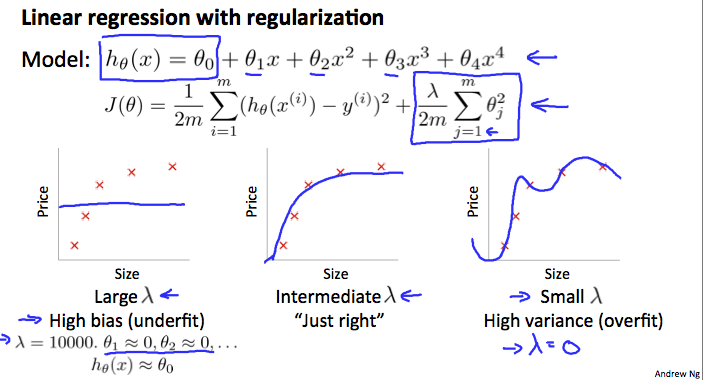

In the figure above, we see that as λ increases, our fit becomes more rigid. On the other hand, as λ approaches 0, we tend to over overfit the data. So how do we choose our parameter $\lambda$ to get it 'just right' ? In order to **choose the model and the regularization term λ**, we need to:

1. Create a list of lambdas (i.e. λ∈{0,0.01,0.02,0.04,0.08,0.16,0.32,0.64,1.28,2.56,5.12,10.24});
2. Create a set of models with different degrees or any other variants.
3. Iterate through the $\lambda$ and for each **λ** go through all the models to learn some Θ.
4. Compute the cross validation error using the learned Θ (computed with λ) on the $J_{cv}(\theta)$ **without** regularization or λ = 0.(这一点很重要，如果在交叉验证下再考虑正则化，则违反了控制变量的原则)
5. Select the best combo that produces the lowest error on the cross validation set.
6. Using the best combo Θ and λ, apply it on  $J_{test}(\theta)$ to see if it has a good generalization of the problem.


### Learning Curves

Training an algorithm on a very few number of data points (such as 1, 2 or 3) will easily have 0 errors because we can always find a quadratic curve that touches exactly those number of points. Hence:

- As the training set gets larger, the error for a quadratic function increases.
- The error value will plateau out（趋于平稳） after a certain m, or training set size.

May be the phenomenon is like that as follows.

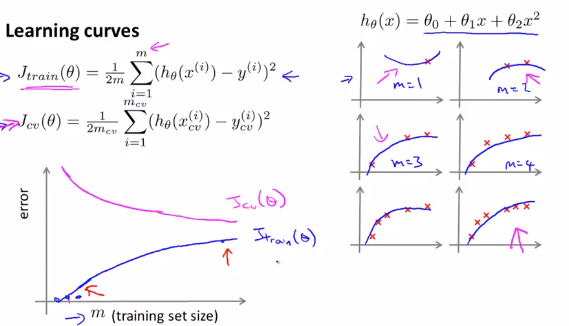

**Experiencing high bias:**

**Low training set size**: causes $J_{train}(\theta)$ to be low and $J_{cv}(\theta)$ to be high.

**Large training set size**: causes both $J_{train}(\theta)$ and $ J_{cv}(\theta)$ to be high with $J_{train}(\theta) \approx J_{cv}(\theta)$ .

If a learning algorithm is suffering from **high bias**, **getting more training data will not (by itself) help much.**


**Experiencing high variance:**

**Low training set size**: $J_{train}(\theta)$ will be low and $J_{cv}(\theta)$ will be high.

**Large training set size**:  $J_{train}(\theta)$ increases with training set size and $J_{cv}(\theta)$continues to decrease without leveling off. Also,  $J_{train}(\theta)$ <  $J_{cv}(\theta)$ but the difference between them remains significant.

If a learning algorithm is suffering from **high variance**, **getting more training data is likely to help.**


### Deciding What to Do Next Revisited

Our decision process can be broken down as follows:

- **Getting more training examples:** Fixes high variance(得到更多的样本无法改善high bias现象)

- **Trying smaller sets of features:** Fixes high variance（过拟合的可能原因是特征过多）

- **Adding features:** Fixes high bias

- **Adding polynomial features:** Fixes high bias

- **Decreasing λ:** Fixes high bias（此条和下面一条是有关正则化对拟合的影响）

- **Increasing λ:** Fixes high variance.

### **Diagnosing Neural Networks**

神经网络的欠拟合和过拟合现象的处理方法与上文类似，几乎相同

- A neural network with fewer parameters is **prone to underfitting**. It is also **computationally cheaper**.
- A large neural network with more parameters（比如说多搞了几层隐藏层） is **prone to overfitting**. It is also **computationally expensive**. In this case you can use regularization (increase λ) to address the overfitting.

Using a single hidden layer is a good starting default. You can train your neural network on a number of hidden layers using your cross validation set. You can then select the one that performs best.

**Model Complexity Effects:**

- Lower-order polynomials (low model complexity) have high bias and low variance. In this case, the model fits poorly consistently（模型的一致性很差）.（欠拟合）
- Higher-order polynomials (high model complexity) fit the training data extremely well and the test data extremely poorly. These have low bias on the training data, but very high variance.（过拟合了）
- In reality, we would want to choose a model somewhere in between, that can generalize well but also fits the data reasonably well.


## Building a Spam Classifier

### Prioritizing What to Work On

**System Design Example:**

Given a data set of emails, we could construct a vector for each email. Each entry in this vector represents a word. The vector normally contains 10,000 to 50,000 entries gathered by finding the most frequently used words in our data set. If a word is to be found in the email, we would assign its respective entry a 1, else if it is not found, that entry would be a 0. Once we have all our x vectors ready, we train our algorithm and finally, we could use it to classify if an email is a spam or not.


So **how could you spend your time to improve the accuracy of this classifier?**

- Collect lots of data (for example "honeypot" project but doesn't always work)
- Develop sophisticated features (for example: using email header data in spam emails)
- Develop algorithms to process your input in different ways (recognizing misspellings in spam).

It is difficult to tell which of the options will be most helpful.


### Error Analysis

The recommended approach to solving machine learning problems is to:

- Start with a simple algorithm, implement it quickly, and test it early on your cross validation data.
- Plot learning curves to decide if more data, more features, etc. are likely to help.
- Manually examine the errors on examples in the cross validation set and try to spot a trend where most of the errors were made.

For example, assume that we have 500 emails and our algorithm misclassifies a 100 of them. We could manually analyze the 100 emails and categorize them based on what type of emails they are. We could then try to come up with new cues and features that would help us classify these 100 emails correctly. Hence, if most of our misclassified emails are those which try to steal passwords, then we could find some features that are particular to those emails and add them to our model. We could also see how classifying each word according to its root changes our error rate:


It is very important to get error results as a single, numerical value. Otherwise it is difficult to assess your algorithm's performance. For example if we use stemming, which is the process of treating the same word with different forms (fail/failing/failed) as one word (fail), and get a 3% error rate instead of 5%, then we should definitely add it to our model. However, if we try to distinguish between upper case and lower case letters and end up getting a 3.2% error rate instead of 3%, then we should avoid using this new feature. Hence, we should try new things, get a numerical value for our error rate, and based on our result decide whether we want to keep the new feature or not.

实践宗旨是快速实现一个可运行的模型，根据模型运行的结果，决定接下来的时间分配和动作。

## Handing Skewed Data

### Error Metrics for Skewed Classses(准确率与召回率)

The idex of precision and recall is a great way to weight the proformence of algorithm even if the data is skewed.

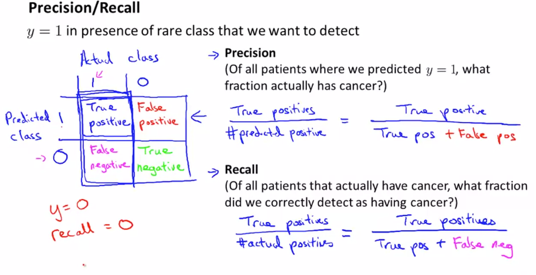

