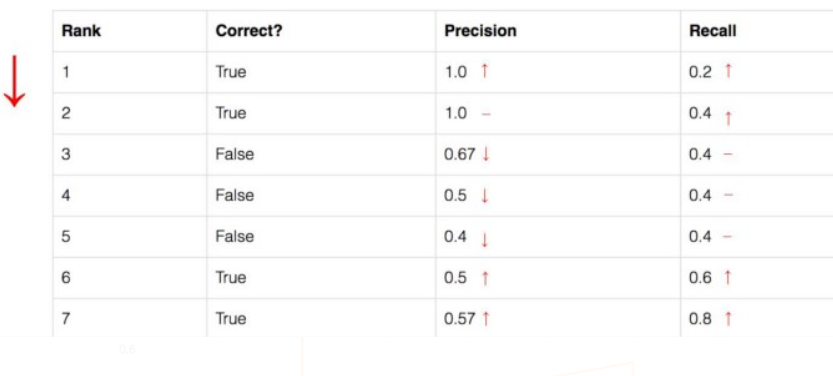
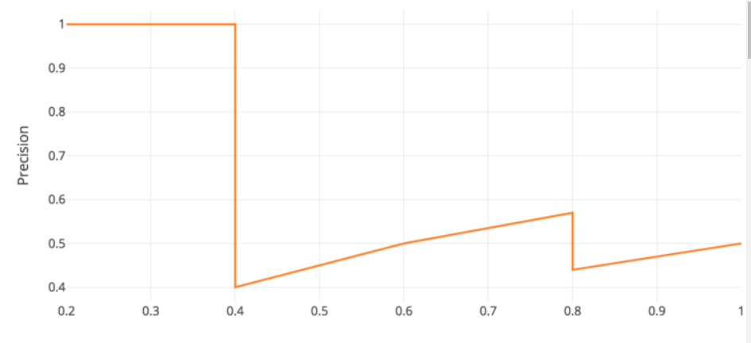
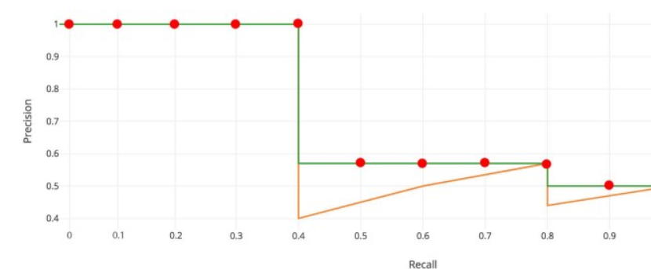
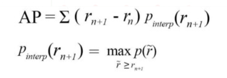
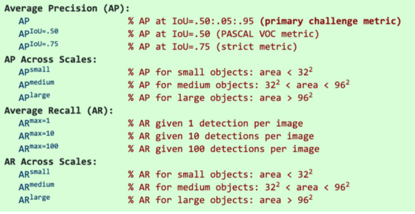
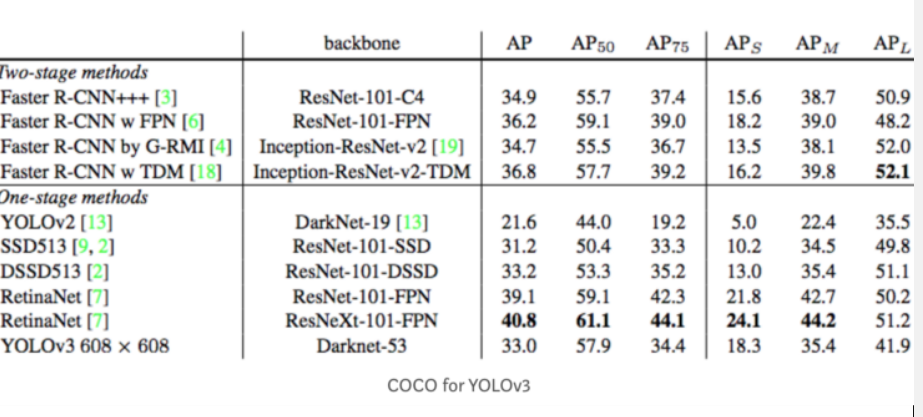

2020/12/2 20:03
[TOC]


# [评价指标](https://jonathan-hui.medium.com/map-mean-average-precision-for-object-detection-45c121a31173)

> 这篇文章太强了

## **Precision** 

measures how accurate is your predictions. i.e. the percentage of your predictions are correct.


$$
P = \frac{TP}{TP+NF}
$$
## **Recall** 

measures how good you find all the positives. For example, we can find 80% of the possible positive cases in our top K predictions.

```math
V = \frac{TP}{TP + NP}
```


## `accurary`
(准确率)：判断所有样本的能力
$$
ACC= \frac{TP}{ALL}
$$

## `F`
`F` 召回率和精确率的调和数


> 任何一个数字变化都会导致F减少。

$$
F = \frac{V * P * 2}{V + P}
$$
## **IoU**: Intersection over union

We use that to measure how much our predicted boundary overlaps with the ground truth.


## coverage
对样本的响应程度，比如街景中人脸识别的响应的数量和视频中人的总量的比例就是corerage。

## AP: the average precision

### definition

从according to the predicted confidence level排序的下图可以得出，Recall计算数目递减的规律。将其对应的`precision`画成一张图。



可以得到简单的APl定义
$$
AP =  \int_0^1{p(r)dr}
$$




为了避免 be suspectable to  small variations in the ranking.


> 比如说相同predicted confidence level 的rows交换，可能导致AP变化？
>
> 这里有更权威的解答：According to the original researcher, the intention of using 11 interpolated point in calculating AP is：
>
> *The intention in interpolating the precision/recall curve in this way is to reduce the impact of the “wiggles” in the precision/recall curve, caused by small variations in the ranking of examples.*

### Smooth

**smooth** the precision-recall curve:
$$
p_{inter}(r) = \max_{\hat r \geq r}P(\hat r)
$$
这就是`interpolated AP`.



这里就可以直接离散化计算了

This interpolated method  **suffers** two issues. It is **less precise**. Second, it lost the capability in measuring the **difference for methods** with low AP. Therefore, a different AP calculation is adopted after 2008 for PASCAL VOC.

### AP (Area under curve AUC)

Instead of sampling all the points, the algorithm just sample `$p(r_i)$` whenever it drops and computes AP as the sum of the rectangular blocks.


可以看到，算法精确的描述了掉落点的位置？？？不太懂



$$
\begin{array}{l}
\mathrm{AP}=\Sigma\left(r_{n+1}-r_{n}\right) p_{\text {inter}}\left(r_{n+1}\right) \\
p_{\text {interp}}\left(r_{n+1}\right)=\max _{\tilde{r} \geq r_{n-1}} p(\tilde{r})
\end{array}
$$

### COCO mAP



例子




mAP (mean average precision) is the average of AP.

In some context, we compute the AP for each class and average them. But in some context, they mean the same thing. For example, under the COCO context, there is no difference between AP and mAP. Here is the direct quote from COCO:

> *AP is averaged over all categories. Traditionally, this is called “mean average precision” (mAP). We make no distinction between AP and mAP (and likewise AR and mAR) and assume the difference is clear from context.*


